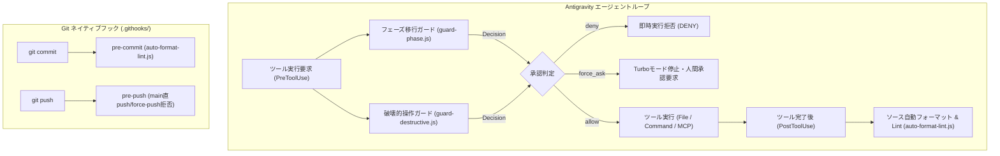

# Antigravity Lifecycle Hooks & Git Native Hooks

本ディレクトリ（`.agents/hooks/`）では、Antigravity の自律型AIエージェントの安全な自律稼働とコード品質を担保するための **Lifecycle Hooks** および **Git Native Hooks** を管理します。

---

## 1. フック全体アーキテクチャ



---

## 2. フック一覧と仕様

| フック名 | イベント種別 | マッチャー / 対象 | 主な責務・防護内容 |
| :--- | :--- | :--- | :--- |
| **`phase-transition-guard`** | `PreToolUse` | `replace_file_content`<br>`write_to_file`<br>`run_command` | `PROJECT_STATUS.md` のフェーズ移行・ゲート承認ステータス変更時、Turboモードを自動中断して人間の承認（`force_ask`）を強制。 |
| **`destructive-operation-guard`** | `PreToolUse` | `run_command`<br>`call_mcp_tool` | AWSインフラ破壊（`s3 rb`, `dynamodb delete-table`, `terraform destroy`等）およびGit破壊的操作（`push --force`, `main` 直push等）を機械的に遮断（`deny`）または確認（`force_ask`）。 |
| **`token-budget-guard`** | `PreToolUse` | `view_file`<br>`run_command` | **トークン消費の事前防止**: 巨大ファイル・ロックファイルの閲覧時に自動スライス（`overwrite`）、`git log` や `npm list`、`Get-ChildItem -Recurse` に出力件数・階層制限を自動付加、ロックファイル全画面ダンプを遮断。 |
| **`token-context-monitor`** | `PreInvocation` | 全ツール呼び出し前 | **Token Bloat早期警戒**: 累積ステップ数やトランスクリプトサイズを監視。閾値到達時に `ephemeralMessage` でサブエージェント委任やセッションリフレッシュ（`/clear`）を機械的にガイダンス。過剰通知を防ぐレートリミット内蔵。 |
| **`source-format-lint-hook`** | `PostToolUse` | `write_to_file`<br>`replace_file_content` | ソースファイル作成・編集時に Prettier / ESLint / Biome / 内蔵正規化（行末空白削除、末尾改行保証、JSON構文チェック、JS構文検証等）を自動適用。 |
| **`.githooks/pre-commit`** | Git Native | `git commit` | ステージングされたソースファイルに対して自動フォーマットおよび構文チェックを実行。 |
| **`.githooks/pre-push`** | Git Native | `git push` | `main` / `master` ブランチへの直接プッシュおよび保護ブランチ削除を拒否。 |

---

## 3. トークン最適化フックの詳細仕様

### A. トークン予算ガード (`token-budget-guard.js`)
- **`view_file` の自動スライシング (`overwrite`)**:
  - `package-lock.json`, `yarn.lock`, `pnpm-lock.yaml` 等のロックファイル:
    - 行範囲未指定の場合、先頭150行（`StartLine: 1, EndLine: 150`）に自動制限。
  - 300行を超えるソースファイル・設計書:
    - 行範囲未指定の場合、先頭250行（`StartLine: 1, EndLine: 250`）に自動制限。
    - 指定範囲が400行を超える場合、上限400行に自動補正。
- **`run_command` の自動出力制限 (`overwrite`)**:
  - `git log`: 件数制限（`-n`, `--max-count`）がない場合、自動的に `-n 20` を付加。
  - `npm list` / `pnpm list`: `--depth` がない場合、自動的に `--depth=0` を付加。
  - ``Get-ChildItem -Recurse`` / `gci -Recurse`: 階層制限がない場合、`-Depth 3` を自動付加。
  - `cat package-lock.json` / `type package-lock.json`: ターミナルへのロックファイル全量出力を機械的に `deny`。

### B. トークン・コンテキストモニター (`token-context-monitor.js`)
- **コンテキスト肥大化の段階的検知**:
  - **Notice（累積 20 ステップ到達）**: サブエージェントへのオフロード推奨ガイダンスを注入。
  - **Alert（累積 35 ステップ到達）**: Token Bloat 警告と `PROJECT_STATUS.md` 保存、セッションリフレッシュ（``/clear``）の実行を強く推奨。
- **通知抑制（Rate Limiting）**:
  - 毎ステップ無駄に通知を出してトークンを浪費しないよう、テンポラリファイル（`os.tmpdir()`）でセッションごとの最終通知ステップを追跡し、重要節目でのみ注入。

---

## 4. ソースファイル自動フォーマット ＆ Lint フック (`auto-format-lint.js`)

### 対象拡張子
- **JavaScript / TypeScript**: `.js`, `.mjs`, `.cjs`, `.jsx`, `.ts`, `.mts`, `.cts`, `.tsx`
- **JSON / YAML**: `.json`, `.jsonc`, `.yaml`, `.yml`
- **Python**: `.py`
- **Go / Rust**: `.go`, `.rs`
- **Web**: `.html`, `.css`, `.scss`, `.sass`, `.less`
- **Shell / Markdown / SQL**: `.sh`, `.bash`, `.ps1`, `.md`, `.sql`

### 段階的実行フロー
1. **外部ツールの自動検知と実行**:
   - プロジェクト内に Prettier, ESLint, Biome, Ruff, gofmt, rustfmt が存在する場合、それらを優先して自動実行（`--fix`, `--write`）。
2. **内蔵ゼロ依存フォーマッタ (Built-in Normalizer)**:
   - 外部ツールが未導入の初期基盤（Phase 0-A 等）でも動作：
     - 行末の不要な半角スペース・タブの自動削除（Markdownの意図的な半角2スペース改行は保持）。
     - ファイル末尾の改行（Newline at end of file）の正規化（単一改行に統一）。
     - JSONファイルのインデント整形（2スペースインデント）。
3. **構文チェック (Syntax Validation)**:
   - Node.js `vm.Script` による JS 構文エラーの検知。
   - `JSON.parse` による JSON 構文エラーの検知。
   - Python `py_compile` による Python 構文エラーの検知。

---

## 4. テスト・検証コマンド

以下のテストスクリプトにより、フックの動作をいつでも検証できます：

```bash
# トークン最適化・コンテキスト監視フックのテスト (12件)
node .agents/hooks/test-token-hooks.js

# ソースファイル自動フォーマット & Lint フックのテスト (9件)
node .agents/hooks/test-format-lint-hook.js

# フェーズ移行ガードのテスト
node .agents/hooks/test-hook.js

# 破壊的操作ガードのテスト (29件)
node .agents/hooks/test-destructive-hook.js
```
