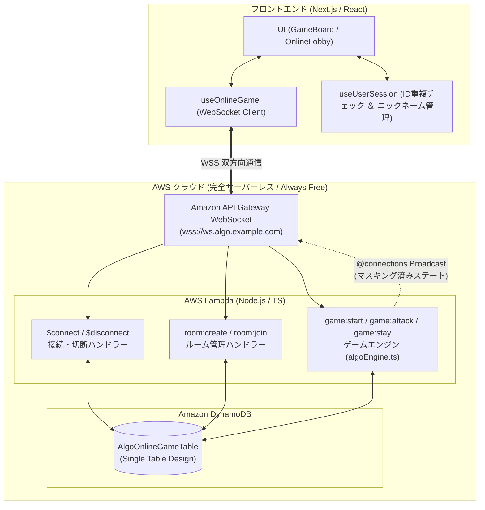

# ADR-0002: オンライン対戦機能のアーキテクチャ選定と処理方式（サーバー権威型 WebSocket 構成 ＆ プレイヤー識別・ニックネーム表示規約）

## ステータス
- **状態**: `PROPOSED`
- **起票日**: 2026-10-02
- **承認日**:
- **提案者**: システムアーキテクト (`role:architect`) ＆ 専門サブエージェントチーム横断
- **承認者**: 人間ゲートキーパー

---

## 1. コンテキストと課題 (Context & Problem Statement)

現在「アルゴ（algo / NumLogic）Web対戦システム」は、Next.jsクライアント上で完結する「CPU対戦モード」が安定稼働している（Phase 1 ギャップ解消・自動テスト全358件パス完了）。
本プロジェクトの当初構想（`specs/requirements.md` 3.3節）である**「オンライン対戦モード（複数プレイヤー間でのリアルタイム対戦）」**をいよいよ実装するにあたり、システム全体の通信方式・状態管理・データモデル・インフラ基盤・セキュリティ境界、およびプレイヤー識別・表示規約を抜本的に拡張する必要がある。

特に以下の課題と設計判断が求められている：
1. **チート防止（最重要課題）**:
   - アルゴは「伏せられた相手の数字を推理する」不完全情報ゲームである。
   - クライアント側に相手の裏向きカードの数字データが送信された場合、ブラウザのDevToolsやパケットキャプチャによって容易に相手の数字が覗き見できてしまう。
2. **リアルタイム双方向通信の方式選定**:
   - ターン制ボードゲームにおけるカードのドロー、アタック（推理）、開示演出、持ち時間タイマーを複数端末間で低遅延かつ同期して反映する必要がある。
3. **AWS無料枠最大活用とゼロコスト運用の継続**:
   - プロジェクト基本方針（`specs/requirements.md` 4節）に基づき、常時起動サーバーによる固定課金を回避し、AWS常時無料枠（Always Free）内に収める必要がある。
4. **切断・再接続・放置プレイヤー対策**:
   - モバイル回線等での一時的な切断や、負けそうになったプレイヤーのアプリ切断・放置に対して、ゲームが進行不能（スタック）にならない仕組みが必要。
5. **プレイヤー識別・重複排除とニックネーム表示（オンライン/オフライン共通）**:
   - サービスアクセス時に自動付与されるゲストユーザーID（`usr_xxxxxxxx`）について、ID衝突を防ぐための**機械的重複チェック機能**が未定義であった。
   - 暗号的なランダムIDだけでは画面上で他プレイヤーから誰であるか直感的に識別しにくいため、ユーザーが任意の**「ニックネーム」**を設定可能とし、画面上では一貫して **`ニックネーム（ユーザーID）`** の形式で表示・識別する規約が必要。

---

## 2. 検討した選択肢 (Considered Options)

### 通信アーキテクチャ方式の比較検討

#### 選択肢 1: AWS サーバーレス WebSocket (API Gateway WebSocket + AWS Lambda + Amazon DynamoDB) 【推奨・採択案】
- **概要**:
  - API Gateway WebSocket API をエンドポイントとし、接続管理（$connect, $disconnect）およびメッセージルーティング（room, gameアクション）を AWS Lambda で処理。
  - ゲーム状態および接続情報は Amazon DynamoDB（Single Table）に保存し、API Gateway Management API（`@connections`）を用いて個別/ブロードキャスト配信を行う**サーバー権威型（Server-Authoritative）アーキテクチャ**。
- **メリット**:
  - **完全ゼロコスト運用**: 常時起動インスタンスが不要。AWS無料枠（API Gateway WebSocket: 毎月100万接続時間・100万メッセージ無料、Lambda: 100万リクエスト無料、DynamoDB: 25GBストレージ無料）により、個人〜小規模運用で月額 $0.00 を達成可能。
  - **チート完全排除**: サーバー側でカードの数字を管理し、他プレイヤーへ配信する際は `number: null` に不可逆マスキングして送信するため、クライアント解析による透視が物理的に不可能。
  - **既存資産の最大活用**: 純粋関数で設計された `algoEngine.ts` のゲームルール検証ロジックを、Lambda関数（Node.js / TypeScript）へそのまま流用可能。
  - **自動回復・TTL**: DynamoDB TTL により、放置ルームや切断セッションが追加コストなしで自動クリーンアップされる。
- **デメリット・許容するトレードオフ**:
  - ステートレスなLambdaからWebSocket送信するため、状態取得・更新にDynamoDBへの都度アクセスが発生する（ただしP95レイテンシ < 100ms であり、ターン制思考ゲームの許容範囲内）。

#### 選択肢 2: コンテナ型リアルタイムサーバー (Node.js / Socket.io on AWS App Runner / ECS Fargate) 【不採用】
- **概要**: 常時起動するNode.jsプロセス上で Socket.io または `ws` を稼働させ、サーバーメモリ内でインメモリにルームとゲームステートを管理する方式。
- **不採用の理由**: コンテナ（最小0.25 vCPU / 0.5GB）を常時稼働させる必要があり、AWS App Runner または ECS Fargate で月額約 $15 〜 $30 以上の固定インフラ費用が発生する。プロジェクト要件である「AWS無料枠最大活用によるゼロコスト運用」に反するため却下。

#### 選択肢 3: WebRTC DataChannel (Peer-to-Peer) 【不採用】
- **概要**: シグナリングサーバー（STUN/TURN）経由でブラウザ同士を直接P2P接続し、サーバーを介さずクライアント間で直接メッセージをやり取りする方式。
- **不採用の理由**: アルゴは「相手の数字を秘密にする」ゲームであるため、P2P接続では「誰が完全な山札・手札データを保持するか」という権威性の問題が発生する。暗号学的コミットメント（Zero-Knowledge Mental Poker等）は過剰に複雑化してバグの温床となるため、チート防止の観点から却下。

#### 選択肢 4: フルマネージド BaaS (Supabase Realtime / Firebase Realtime DB) 【不採用】
- **概要**: Supabase Postgres Changes / Broadcast や Firebase を利用してクライアント間で同期する方式。
- **不採用の理由**: AWS以外の外部SaaSへの依存が発生し、既存のCloudFormationおよびAWSインフラ設計書と乖離する。また無料枠ポーズ機能の運用課題があるため却下。

---

## 3. 決定事項 (Decision Outcome)

1. **基本アーキテクチャ**:
   - **「選択肢 1: AWS サーバーレス WebSocket (API Gateway WebSocket + AWS Lambda + Amazon DynamoDB)」** を正式採択する。
   - ゲームの公平性とセキュリティを保証するため、**「サーバー権威型（Server-Authoritative）ステートマスキングモデル」** を採用する。
2. **ユーザーID重複チェック方式**:
   - クライアント側: `getKnownUserIds()` による既知プール突合と、`generateUniqueUserId()` による重複自動検知・再試行（最大20回）による一意性保証。
   - サーバー側: DynamoDB の条件付き書き込み（`attribute_not_exists(userId)`）による二重登録防止。
3. **ニックネーム設定と画面表示規約（オンライン/オフライン共通）**:
   - ユーザーIDとは独立してユーザーが任意の「ニックネーム」を設定可能とする（デフォルト: `あなた`、最大15文字制限、サニタイズ処理）。
   - クライアント側の Cookie（`algo_nickname`）および LocalStorage に永続化。
   - 画面上では一貫して **`ニックネーム（ユーザーID）`**（例: `あなた（usr_t7ynlu04）`、`名探偵アリス（usr_a1b2c3d4）`）の形式で統一表示する。

---

## 4. 各専門担当における詳細処理方式の検討結果

### 4.1 システムアーキテクト (`role:architect`)
- **権威サーバーモデルと不可逆ステートマスキング**:
  - 山札生成・シャッフル・配布・アタック判定・勝敗判定はすべてLambda上の `algoEngine` が唯一の決定権を持つ。
  - 受信プレイヤーの伏せカードおよび全プレイヤーのオープン済みカードのみ `number`（数字）を含め、相手の伏せカードおよび山札は `number: null` に置換して配信。
- **プレイヤー識別・表示規約の策定**:
  - システム内部識別子: 不変のユニークID（`userId: usr_xxxxxxxx`）。
  - 表示用識別子: 人間が認知しやすいニックネームとユニークIDを結合した `formatUserDisplayName(nickname, userId)` -> `ニックネーム（ユーザーID）`。

### 4.2 フロントエンド担当 (`role:frontend`)
- **画面フローの拡張**:
  - スタート画面に「CPU対戦」「オンライン対戦」のモード選択を追加。
  - ロビー画面（ルーム作成/4桁コード参加）、待機画面（参加者アバター・準備完了・対戦開始）、対戦画面（接続状態インジケータ・サーバー同期タイマー）。
- **ニックネーム設定UIと画面表示の実装方針**:
  - セットアップ画面に「ニックネーム設定」入力欄（`data-testid="input-nickname"`）を設置。
  - バッジ表示: `👤 ゲストID: ニックネーム（ユーザーID）`
  - 対戦相手構成（Roster）プレビュー: `ニックネーム（ユーザーID）（手札4枚）`
  - 盤面表示: 手札ヘッダー（`ニックネーム（ユーザーID）の手札`）、ターン表示、アタック結果、対戦ログ、決着画面（ResultModal）など全箇所で統一表示。
- **WebSocket接続管理フック (`useOnlineGame`)**:
  - 指数バックオフ自動再接続（1s, 2s, 4s... 最大10s、最大5回）。
  - サーバーから返信される `game:attack_result` および `game:state_sync` を唯一の情報源として画面を更新（楽観的更新の排除）。

### 4.3 バックエンド/API担当 (`role:backend`)
- **WebSocket ルーティング規約**:
  - `$connect`: 接続確立時にクエリパラメータの `userId`, `nickname`, `roomCode` を検証、`Connections` テーブルに保存。
  - `$disconnect`: 切断検知時、所属ルームの他プレイヤーへ `player:disconnected` を即時通知。
  - `room:create`: 4桁の英数字ルームコード（例: `A8K2`）を払い出し、ホストとしてルーム作成。
  - `room:join`: ルームコード照合、定員（2〜4人）およびゲーム未開始を確認し、ルーム参加者全員へ参加者の `nickname` および `userId` をブロードキャスト。
  - `game:start`: ホストのみ実行可能。`algoEngine.ts` により初期手札配布、各プレイヤーへ個別マスキング初期ステートを配信。
  - `game:draw`: 手番プレイヤーのみ実行可能。山札から1枚引き、引いたプレイヤーにのみ `game:draw_private`（数字入り）を配信し、他プレイヤーには色のみブロードキャスト。
  - `game:attack`: 手番プレイヤーのアタック（対象者ID、対象カードID、推理数字）を検証し、結果をブロードキャスト。
  - `game:stay`: 的中後の継続/ステイ選択。
- **ロジック再利用**:
  - `src/lib/algoEngine.ts` の純粋関数群（`checkAttack`, `sortCards`, `insertOrder` 等）をLambda環境でそのまま100%流用。

### 4.4 データベース担当 (`role:db`)
- **Amazon DynamoDB Single Table Design**:
  - テーブル名: `AlgoOnlineGameTable`

| エンティティ種別 | PK | SK | 主要属性 | 用途・アクセスパターン |
| :--- | :--- | :--- | :--- | :--- |
| **接続セッション (Connection)** | `CONN#<connectionId>` | `METADATA` | `userId`, `nickname`, `roomId`, `ttl` | 接続時のConnection管理、切断時逆引き |
| **ルーム情報 (Room)** | `ROOM#<roomId>` | `METADATA` | `roomCode`, `hostId`, `status`, `playerCount`, `maxPlayers`, `players` (userId, nickname等のJSON), `ttl` | ルーム作成・参加・待機ロビー管理 |
| **ルームコード逆引き** | `ROOMCODE#<roomCode>` | `ROOM#<roomId>` | `roomId`, `ttl` | 4桁コードからroomIdをO(1)で特定（GSI不要） |
| **ゲーム状態 (GameState)** | `ROOM#<roomId>` | `STATE` | `version`, `turnPlayerId`, `phase`, `deck`, `hands`, `logs`, `updatedAt` | ゲーム進行中の完全な状態管理 |

- **排他制御（Optimistic Locking）**:
  - `GameState` 更新時は DynamoDB Conditional Check (`attribute_exists(version) AND version = :expectedVersion`) を必須とし、二重アタックやタイムアウト処理との競合を防止。
- **TTL自動クリーンアップ**:
  - 全アイテムに `ttl` を設定し、ルーム完了後24時間で自動削除（コスト完全防止）。

### 4.5 インフラ基盤担当 (`role:infra`)
- **IaC テンプレート拡張 (`infrastructure/cloudformation/websocket.yaml`)**:
  - API Gateway WebSocket + Lambda (ARM64 Graviton3) + DynamoDB (TTL有効化) + 最小権限IAMロール。
- **コスト・無料枠検証**:
  - 月間1,000ゲーム（2人対戦・15分）想定で、接続時間・メッセージ数・Lambda実行・DynamoDB容量のすべてがAWS常時無料枠内に収まり、**月額費用 完全 $0.00** を達成。

### 4.6 セキュリティ監査担当 (`role:security`)
- **多層防御設計の適用**:
  1. **リソース/データ層 (チート防止の物理的強制)**:
     - 秘密情報（裏向きカードの数字）はDynamoDB/Lambdaのみに留め、クライアント通信から不可逆マスキング。
  2. **呼び出し層 (認可・手番強制)**:
     - 手番外プレイヤーからの `game:draw` や `game:attack` は即座に遮断。
  3. **ツール/ビジネスロジック層 (スキーマ・不正操作バリデーション)**:
     - アタック対象カード状態、0〜11の範囲検証。
     - **ニックネームのサニタイズ**: XSS防止（HTMLタグの無効化・エスケープ）、最大15文字制限、空白文字のトリミング。
  4. **レートリミット & DDoS対策**:
     - 単一接続からのリクエスト頻度制限（1秒間に最大5リクエスト）。

### 4.7 システム運用/SRE担当 (`role:ops`)
- **切断・放置対策（サレンダー＆タイムアウト制御）**:
  - 切断猶予タイマー（60秒）を設け、復帰しない場合や持ち時間連続超過時は「自動サレンダー」としてゲームスタックを防止。
- **可観測性 (SLO/SLI)**:
  - 接続可用性 99.5% 以上、対戦応答性 P95 < 300ms をSLOとして定義。CloudWatchメトリクスおよび構造化ログで監視。

---

## 5. 結果・影響とトレードオフ (Consequences)

### ポジティブな影響
1. **ユーザー体験の大幅向上**: 離れた友人や全国のプレイヤーとリアルタイム対戦が可能となり、ニックネーム表示により誰と対戦しているかが直感的に把握可能。
2. **完全なチート耐性とID衝突ゼロ**: サーバー権威型マスキングとID重複チェック機構により、公平で安全な対戦基盤を確立。
3. **ゼロコスト運用の堅持**: AWS Always Free枠の範囲内に完全収容。

### トレードオフ・留意事項
1. **実装の複雑性向上**: オフライン（CPU対戦）とオンライン（WebSocket対戦）の状態管理の抽象化。
2. **ネットワーク遅延の影響**: モバイル等の高遅延環境での待機演出の充実。

---

## 6. 設計書への追従反映計画 (Documentation Sync Plan)

人間ゲートキーパーによる本ADR承認後、以下の設計書群を速やかに追従更新する：
- [ ] `specs/requirements.md`: 3.3節のオンライン対戦機能を「将来拡張」から「正式機能要件」へ昇格更新、プレイヤー表示規約（ニックネーム（ユーザーID））を追記
- [ ] `docs/design/backend/api-spec.md`: WebSocket詳細プロトコル、メッセージスキーマ、マスキング関数、ニックネーム属性の正式仕様化
- [ ] `docs/design/frontend/screen-flow.md` & `screen-specs.md`: ロビー画面、マッチングUI、ニックネーム入力UI、接続状態インジケータの追加
- [ ] `docs/design/database/schema-spec.md` & `er-diagram.md`: DynamoDB Single Table設計（Connection, Room, GameState）およびニックネーム属性の追記
- [ ] `docs/design/infrastructure/architecture.md` & `iac-spec.md`: API Gateway WebSocket + Lambda + DynamoDB の構成図・CloudFormationテンプレート定義
- [ ] `docs/design/security/threat-modeling.md`: オンライン対戦における不正アクセス・チート対策・ニックネームXSSサニタイズの脅威分析追加
- [ ] `docs/design/sre/observability-sli-slo.md`: WebSocket接続数、切断率、メッセージレイテンシの監視基準追加
