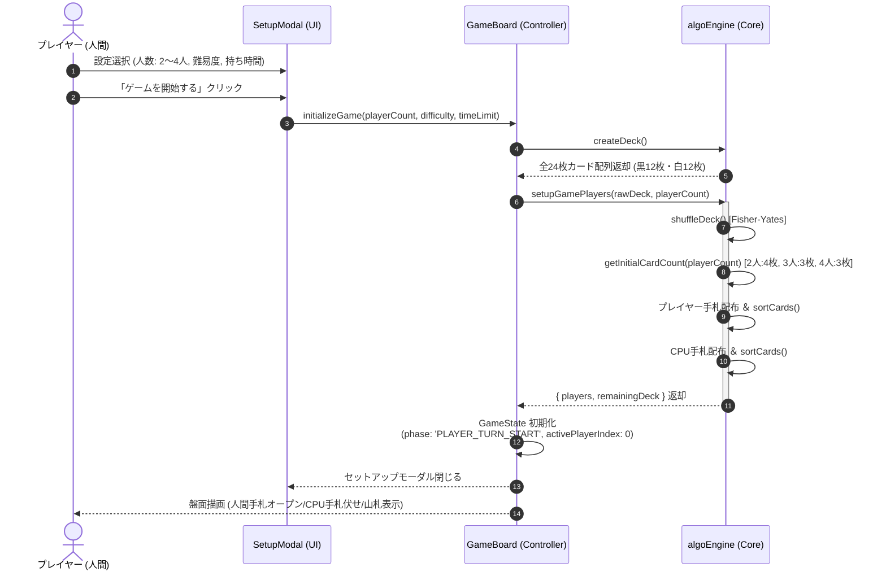
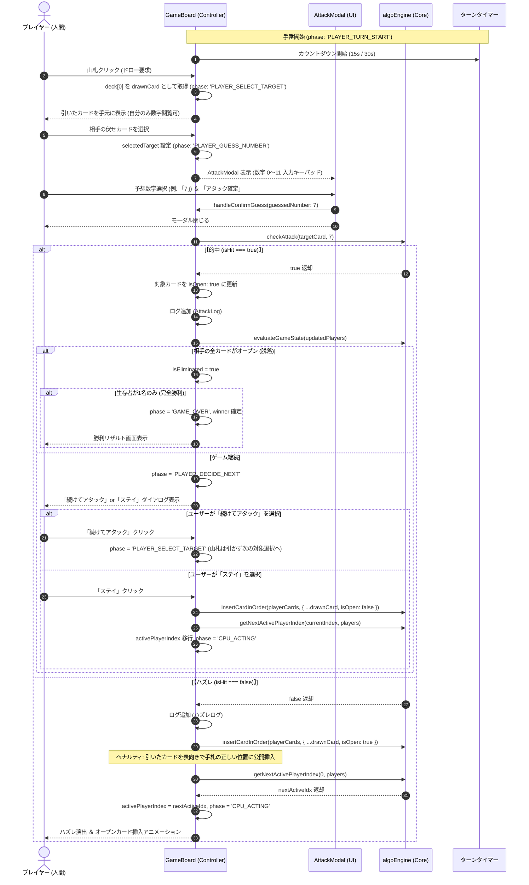
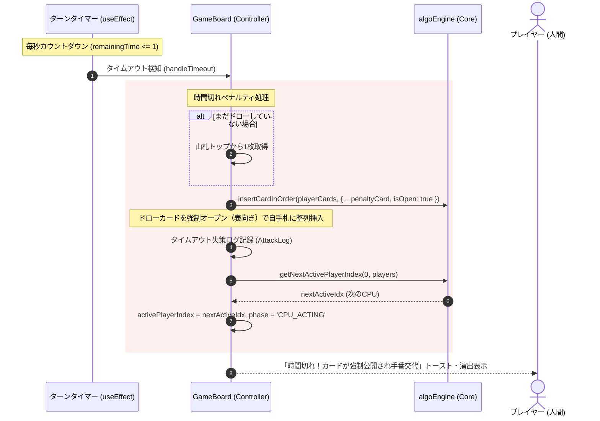
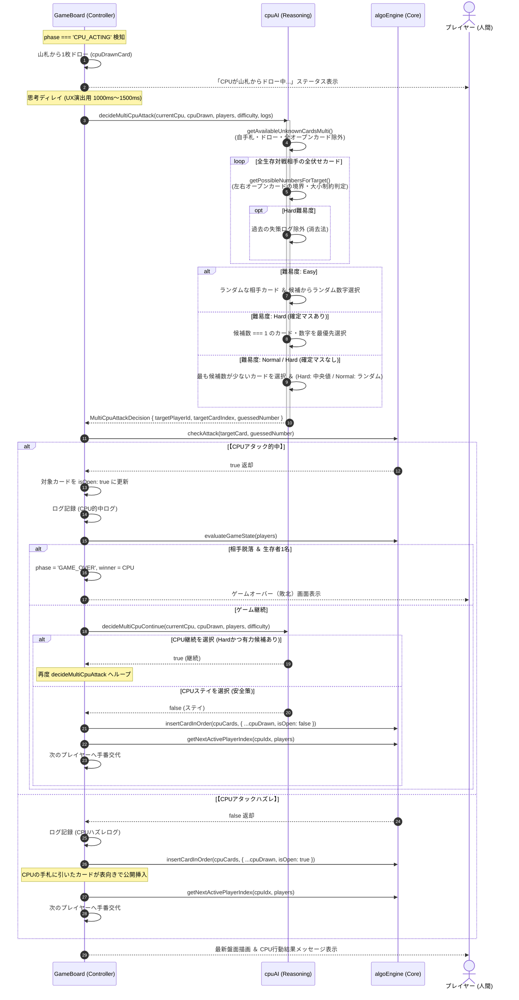
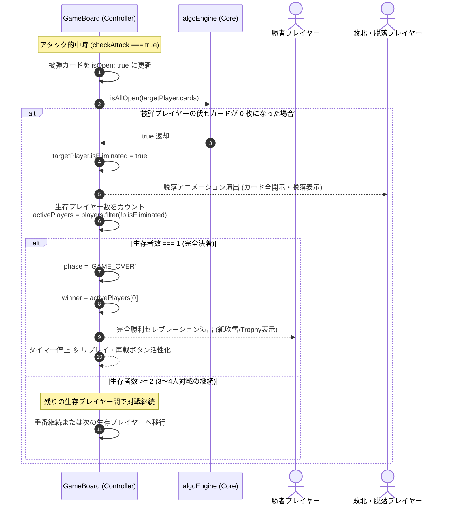

# バックエンド ＆ ゲームロジック 業務シーケンス設計書: アルゴ（algo）Web対戦システム

本設計書は、「アルゴ（algo）Web対戦システム」におけるコアゲームフロー、プレイヤー操作、CPU推論処理、時間切れペナルティ、および勝敗決着のシーケンスをMermaid図を用いて定義します。

---

## 1. 全体アーキテクチャ境界

- **UI / Client Component**: ユーザー入力の受付、カード描画、モーダル表示、タイマー監視。
- **Game Controller (`GameBoard.tsx`)**: React State（`GameState`）のライフサイクル管理とフェーズ遷移のオーケストレーション。
- **Core Engine (`algoEngine.ts`)**: カードデッキ生成、ソート、アタック判定、生存判定等の純粋関数ロジック。
- **CPU AI (`cpuAI.ts`)**: 不完全情報ゲームにおける推論、候補絞り込み、難易度別意思決定。

---

## 2. シーケンス a: ゲーム開始〜初期手札配布シーケンス

プレイヤーが人数（2〜4人）、難易度（Easy/Normal/Hard）、持ち時間（無制限/15秒/30秒）を選択してゲームを開始するフローです。

---

## 3. シーケンス b: プレイヤー手番（ドロー〜アタック〜判定〜コンティニュー/ステイ）

プレイヤーの標準手番サイクルです。ドローからアタック、的中・ハズレによる分岐、および継続またはステイの選択フローを網羅します。

---

## 4. シーケンス c: ターンタイマー切れ（時間切れペナルティ）シーケンス

制限時間（15秒/30秒）内にプレイヤーがアクションを完了しなかった場合の強制ペナルティフローです。

---

## 5. シーケンス d: CPU手番（思考・カード選択・推論・結果反映）シーケンス

CPUが盤面情報と難易度（Easy/Normal/Hard）に基づき、論理的消去法を実行して自律行動するフローです。

---

## 6. シーケンス e: 勝敗決着（サバイバル判定）シーケンス

プレイヤーの手札がすべて表向きになった際の脱落判定と、最後の1人が残った際のサバイバル勝利決定フローです。

