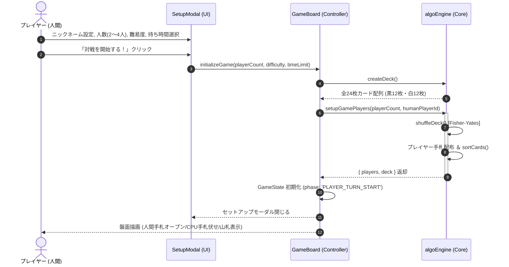
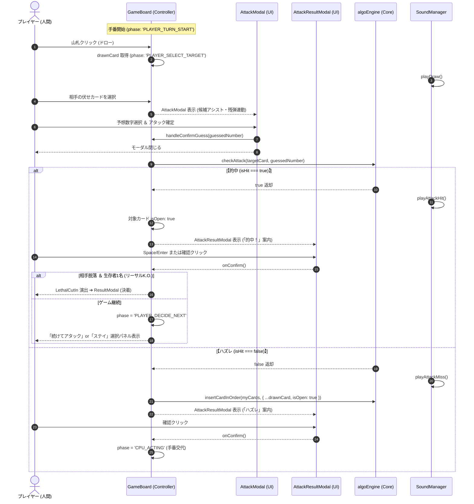
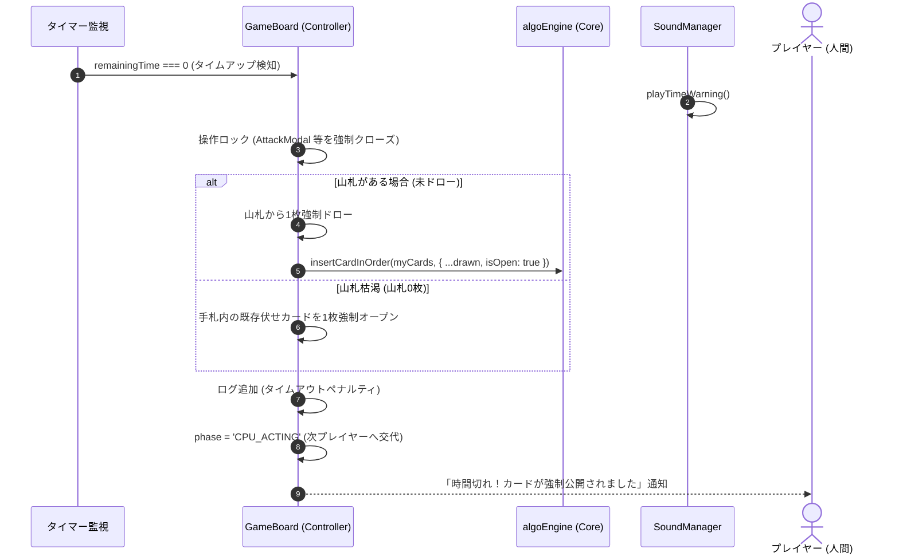
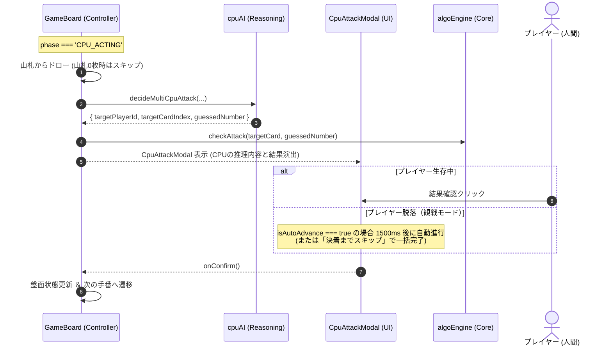
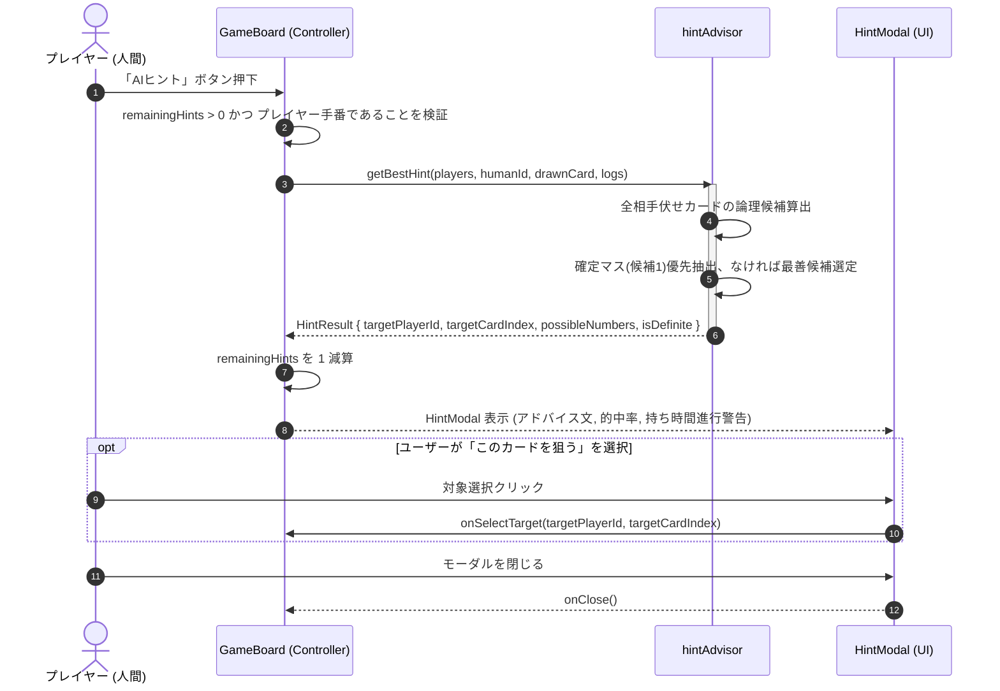
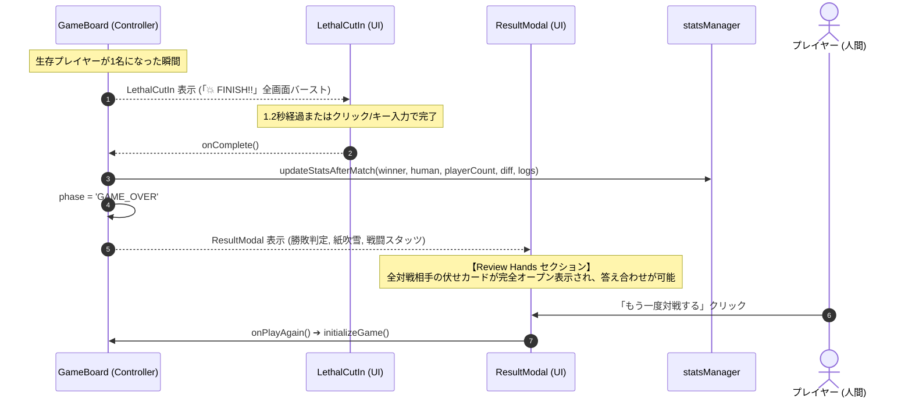

# バックエンド ＆ ゲームロジック 業務シーケンス設計書: アルゴ（algo）Web対戦システム

本設計書は、「アルゴ（algo）Web対戦システム」におけるコアゲームフロー、プレイヤー操作、CPU推論処理、アタック結果確認演出、観戦モード自動進行、AIヒント助言、タイマー制御、および勝敗決着のシーケンスをMermaid図を用いて定義します。

---

## 1. 全体アーキテクチャ境界

- **UI / Client Component**: ユーザー入力の受付、カード描画、モーダル表示（`AttackResultModal`, `CpuAttackModal`, `HintModal`, `ResultModal` 等）、タイマー監視。
- **Game Controller (`GameBoard.tsx`)**: React State（`GameState`）のライフサイクル管理とフェーズ遷移のオーケストレーション。
- **Core Engine (`algoEngine.ts`)**: カードデッキ生成、ソート、アタック判定、生存判定等の純粋関数ロジック。
- **CPU AI (`cpuAI.ts`)**: 不完全情報ゲームにおける推論、候補絞り込み、難易度別意思決定。
- **Support Modules**: `hintAdvisor.ts`（ヒント算出）、`soundManager.ts`（SE発音）、`statsManager.ts`（戦績永続化）。

---

## 2. シーケンス a: ゲーム開始〜初期手札配布シーケンス

---

## 3. シーケンス b: プレイヤー手番（ドロー〜アタック〜結果確認〜継続/ステイ）

---

## 4. シーケンス c: 持ち時間切れ（タイムアウト強制ペナルティ）シーケンス

---

## 5. シーケンス d: CPU手番 ＆ 演出モーダルシーケンス

---

## 6. シーケンス e: AIヒント取得シーケンス (`HintModal`)

---

## 7. シーケンス f: 勝敗決着 ＆ リザルト答え合わせシーケンス

