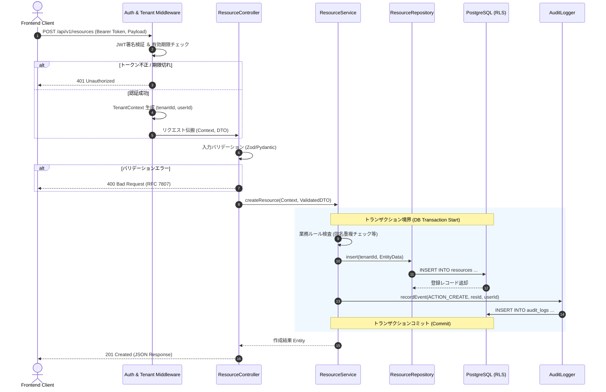
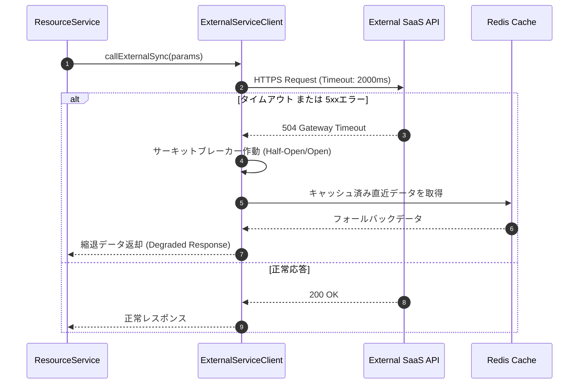

# バックエンド 業務シーケンス ＆ トランザクション設計書

## 1. 概要とアーキテクチャ境界
- **目的**: クライアントリクエストからコントローラー、業務ロジック層（Service）、永続化層（Repository/DB）、外部連携までのデータフローとトランザクション境界を可視化する。
- **認可・テナント境界の強制**:
  - コントローラー前の認証ミドルウェアでJWTをデコードし、コンテキストに `TenantContext(tenantId, userId, roles)` を格納。
  - Service/Repository層ではコンテキストから取り出した `tenantId` を必須パラメータとして扱い、プロンプトやクライアント送信パラメータに依存しない。

---

## 2. 標準業務シーケンス：リソース作成と監査記録

---

## 3. 例外・外部サービス障害時のフォールバックシーケンス

