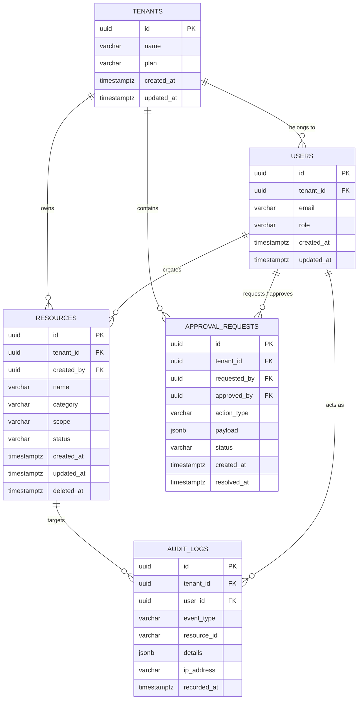

# データベース ER図 ＆ データモデリング設計書

## 1. モデリング方針
- **RDBMS**: PostgreSQL 16+
- **マルチテナント方針**: 共有データベース・共有スキーマ方式（`tenant_id` カラム保持 ＋ Row-Level Security による機械的分離）
- **キー設計**:
  - 主キー（PK）: UUIDv7（タイムスタンプ内包・ソート可能）または ULID
  - 外部キー（FK）: 参照整合性をDB制約として強制
  - タイムスタンプ: `created_at` (TIMESTAMPTZ), `updated_at` (TIMESTAMPTZ) を全テーブルに保持
  - 論理削除方針: 業務監査対象は物理削除せず `deleted_at` (TIMESTAMPTZ) によるソフトデリート

---

## 2. ERダイアグラム (Entity-Relationship Diagram)

---

## 3. カーディナリティとリレーションシップ詳細

| 親エンティティ | 子エンティティ | 関連 (Cardinality) | 削除ポリシー (ON DELETE) | 説明 |
| :--- | :--- | :---: | :--- | :--- |
| `tenants` | `users` | 1 : N | `RESTRICT` | テナント削除時は配下にユーザーが存在しないことを要請 |
| `tenants` | `resources` | 1 : N | `RESTRICT` | テナントに紐づくリソース境界を形成 |
| `users` | `resources` | 1 : N | `RESTRICT` | リソース作成者情報 |
| `tenants` | `approval_requests`| 1 : N | `CASCADE` | テナント内承認キュー |
| `tenants` | `audit_logs` | 1 : N | `NO ACTION` | 監査ログは改ざん・削除防止のため独立保持 |
