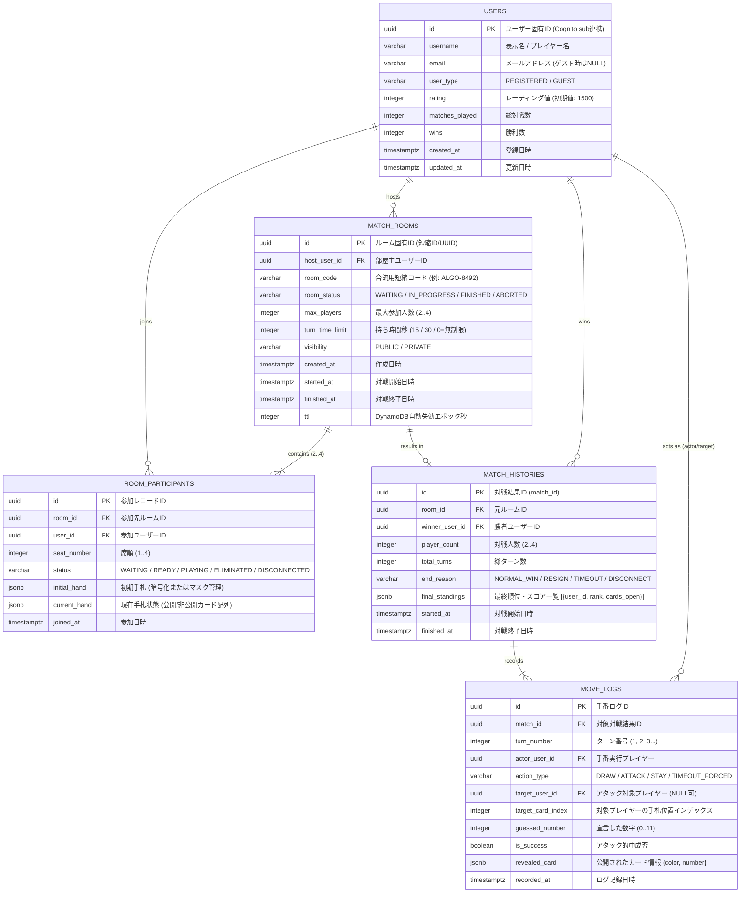

# データベース ER図 ＆ データモデリング設計書 (アルゴ Web対戦システム)

## 1. モデリング方針

本ドキュメントは、「アルゴ（algo）Web対戦システム」におけるオンライン対戦・戦績記録・ルーム管理・手番ログのデータモデルおよびリレーションシップを定義します。

### 1.1 基本設計原則
1. **アルゴのゲームルールへの忠実性**:
   - カード総数24枚（黒: 0〜11, 白: 0〜11）、裏向き（Closed）/表向き（Open）状態の管理。
   - 2人〜4人対戦のプレイヤー席順（Seat 1〜4）およびライフサイクル（待機、対戦中、脱落、勝利）。
2. **高速なリアルタイム対戦と監査・再現性の両立**:
   - 手番単位の推理ログ（MoveLogs）を時系列で完全に記録し、試合の棋譜再生や不正検知を可能にする。
3. **ハイブリッド永続化アーキテクチャ**:
   - プライマリDB（AWS本番環境）: **Amazon DynamoDB**（Single Table Designによる超高速・AWS常時無料枠最適化）。
   - リレーショナル論理モデル（および開発・移行用）: **PostgreSQL 16+**（第3正規形準拠＋戦績集計の戦略的非正規化）。

---

## 2. ERダイアグラム (Entity-Relationship Diagram)

---

## 3. カーディナリティとリレーションシップ詳細

| 親エンティティ | 子エンティティ | 関連 (Cardinality) | 削除ポリシー (ON DELETE) | 整合性制約 ＆ 業務ルール |
| :--- | :--- | :---: | :--- | :--- |
| `USERS` | `MATCH_ROOMS` | 1 : N | `SET NULL` | 部屋主が退会・切断しても、進行中のルームは終了または代理ホスト移行する |
| `MATCH_ROOMS` | `ROOM_PARTICIPANTS` | 1 : 2..4 | `CASCADE` | ルーム破棄時は参加セッション情報も連動削除（待機中ルームのみ） |
| `USERS` | `ROOM_PARTICIPANTS` | 1 : N | `CASCADE` | 1ユーザーは同時に1つのアクティブなルームにのみ参加可能（ユニーク制約） |
| `MATCH_ROOMS` | `MATCH_HISTORIES` | 1 : 0..1 | `RESTRICT` | 試合が成立した場合のみ1件の結果履歴が生成される |
| `USERS` | `MATCH_HISTORIES` | 1 : N | `RESTRICT` | 過去の戦績記録はプレイヤーアカウント削除時も監査・ランキング整合性のため保持 |
| `MATCH_HISTORIES` | `MOVE_LOGS` | 1 : N | `CASCADE` | 1試合あたり平均20〜60手の手番ログが記録される |

---

## 4. 正規化および非正規化方針

### 4.1 第3正規形（3NF）の適用
- ユーザー属性、ルームメタデータ、対戦履歴、手番ログを分離し、更新時異常・重複挿入を防止。
- 手番ごとの推論操作（アタック・判定・公開）を独立したイミュータブル（変更不能）なイベントレコードとして記録。

### 4.2 戦略的非正規化（パフォーマンス・リアルタイム性最適化）
1. **戦績集計カラムの保持 (`USERS` テーブル)**:
   - `matches_played`, `wins`, `rating` を `USERS` テーブルに直接保持。
   - 対戦終了時に `MATCH_HISTORIES` の挿入と同時にアトミック（トランザクション）にインクリメントし、一覧表示時の `COUNT(*)` 集計負荷を排除。
2. **手札スナップショットのJSONB保持 (`ROOM_PARTICIPANTS` テーブル)**:
   - カード24枚の物理テーブルを細分化（カード単位の個別行）せず、プレイヤーごとの手札配列（`current_hand`）をJSONB/Map形式で集約保持。
   - アルゴの手札は最大でも4枚〜6枚程度と極小であるため、行分割によるJOINのオーバーヘッドを避け、1回のI/Oで手札全体の整列・開示状態を取得可能にする。
