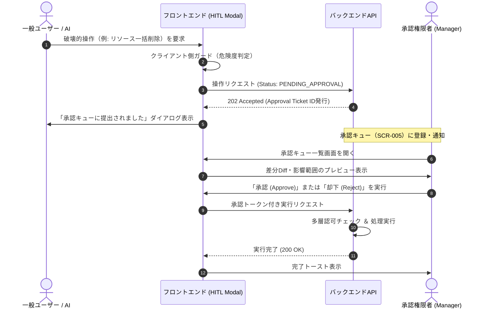

# Human-in-the-loop (HITL) 承認UI・操作ガード設計書

## 1. 概要とガード基準
- **目的**: データの物理削除、外部送信、ロール権限昇格、金銭的移動など「取り消し不能または影響範囲の大きい操作」がAIエージェントまたはユーザーによって即時実行されることを防ぎ、人間の明示的承認（Human-in-the-loop）を強制する。
- **対象アクション一覧**:
  - リソースの物理削除（Delete）
  - 外部APIへのWebhook/メール一括送信
  - ユーザーロール・アクセス権限の変更
  - 本番設定・環境変数・シークレットの変更

---

## 2. HITL承認フローシーケンス



---

## 3. HITL確認モーダル UI仕様

### 3.1 モーダルレイアウト仕様
```text
+-------------------------------------------------------------+
| [!] 重要操作の確認 (Human Verification Required)        [X] |
+-------------------------------------------------------------+
| 警告: この操作は取り消すことができません。                  |
| 以下の変更内容および影響範囲を確認してください。            |
|                                                             |
| 対象: Resource [Prod-Database-Backup-01]                    |
| アクション: 物理削除 (Permanently Delete)                   |
| 実行理由 (AI/User): 「古い保持期間超過によるクリーンアップ」|
|                                                             |
| 確認のため、対象リソース名を入力してください:               |
| [ Prod-Database-Backup-01                                 ] |
|                                                             |
| [ キャンセル ]                      [ 承認キューへ提出 (赤) ]|
+-------------------------------------------------------------+
```

### 3.2 ガードロジック仕様
1. **名前一致確認（Type-to-confirm）**:
   - 危険度が最高（Critical）の操作では、対象リソース名または `DELETE` の文字列を完全一致で入力しない限り、実行ボタンを非活性（`disabled`）にする。
2. **2重クリック防止（Debounce / Loading lock）**:
   - クリック直後にボタンをローディング表示にし、APIレスポンスが返るまで同一リクエストの重複送信を遮断する。
3. **二者承認（Maker-Checker）強制**:
   - 自身が起票したHITLチケットを同一ユーザーが承認することはバックエンド側で機械的に拒絶される。
