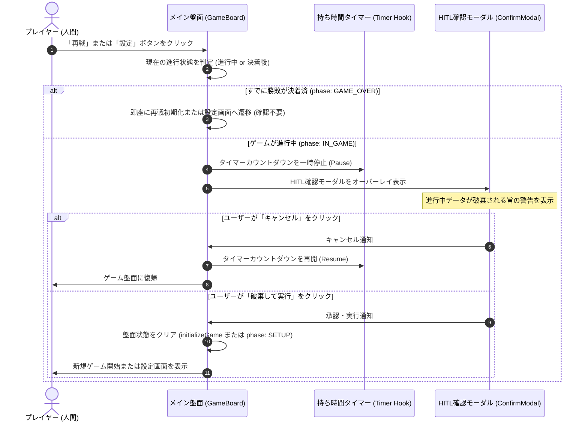

# Human-in-the-loop (HITL) 承認UI・操作ガード設計書: アルゴ（algo）Web対戦システム

## 1. 概要とHITLガード設計方針

- **目的**: 対戦ゲーム中における「不可逆または影響範囲の大きい操作（進行中データの破棄、手番の放棄、設定のリセット）」がユーザーの誤タップやAIエージェントの自律実行によって即座に実行されることを防止し、人間の明示的承認（Human-in-the-loop）を強制する。
- **対象アクション一覧**:
  1. **対戦リセット（再戦・新規ゲーム開始）**: 進行中の盤面・手札情報・対戦ログを破棄して最初からやり直す操作。
  2. **設定変更（セットアップ画面への離脱）**: 現在の対戦を中断し、人数・難易度設定画面へ戻る操作。
  3. **投了（ギブアップ）**: プレイヤーが自ら敗北を受け入れ、ゲームを終了させる操作。
  4. **CPU連続思考の中断**: CPU思考ループ中に緊急でゲームをリセットまたはポーズする操作。

---

## 2. HITL操作ガードフローシーケンス



---

## 3. HITL確認モーダル UI仕様

### 3.1 ワイヤーフレーム概要

```text
+-------------------------------------------------------------+
| [⚠️] 対戦の中断・リセット確認                           [X] |
+-------------------------------------------------------------+
|                                                             |
|  現在ゲームが進行中です！                                   |
|  この操作を実行すると、現在の対戦状況（手札、オープン情報、 |
|  対戦ログ）はすべて破棄されます。                           |
|                                                             |
|  【現在の対戦ステータス】                                   |
|  ・対戦形式: 2人対戦 (CPU: 中級)                            |
|  ・あなたの残り伏せカード: 3枚                              |
|  ・経過ログ数: 6手番                                        |
|                                                             |
|  本当に現在の対戦を終了して、[ 再戦 ] しますか？            |
|                                                             |
|  [ ゲームに戻る (キャンセル) ]      [ 対戦を破棄して再戦 ]   |
|                                     (赤色 / 警告ボタン)     |
+-------------------------------------------------------------+
```

### 3.2 ガード対象アクション別のモーダル差分仕様

| アクション種別 | トリガーUI | 警告メッセージ内容 | 承認ボタンラベル | 承認後アクション |
| :--- | :--- | :--- | :--- | :--- |
| **再戦・盤面リセット** | ヘッダー「🔄 再戦」ボタン | 「現在の対戦状況は破棄されます。同じ設定で最初からやり直しますか？」 | `「対戦を破棄して再戦」` (Rose色) | `initializeGame()` を実行し手札再配布 |
| **設定変更・トップ戻り** | ヘッダー「⚙ 設定」ボタン | 「現在の対戦状況は破棄されます。人数や難易度の設定画面に戻りますか？」 | `「対戦を終了して設定へ」` (Navy色) | `phase: 'SETUP'` に切り替え |
| **投了（ギブアップ）** | 投了ボタン（将来追加時） | 「本当に投了しますか？あなたの手札がすべてオープンとなり敗北となります。」 | `「投了する」` (Rose色) | 人間脱落処理を行い `GAME_OVER` 遷移 |

---

## 4. タイマー制御とHITLの連動仕様

対戦ゲームにおいて最も重要なHITL要件は、**「確認モーダルを開いている間に持ち時間が減算されて時間切れペナルティにならないこと」** です。

1. **タイマーの一時停止 (Timer Pause)**:
   - HITL確認モーダル（またはルール解説モーダル）が開いた瞬間、`useEffect` 内の `setInterval` のカウントダウン処理を機械的に中断（`isPaused = true`）。
2. **タイマーの安全な再開 (Timer Resume)**:
   - モーダルが「キャンセル」または閉じるボタンで閉じられた場合、中断された時点の残り秒数からカウントダウンを再開。
3. **二重操作防止**:
   - モーダル表示中は背景のカード選択、山札クリック、他のボタン操作を `backdrop-blur-sm` および pointer-events の遮断により完全無効化。

---

## 5. エージェント自律実行時（Phase 1）のHITLルール

Antigravity エージェント（`.agents/rules/agent-security-governance.md`）との整合性：
- 自律実装中（Playwright E2E テスト等）に破壊的リセット操作を検証する際は、自動テストスクリプト側で明示的にモーダルの確認ボタン（`data-testid="confirm-reset-btn"`）をハンドリングすること。
- 人間ゲートキーパーが実機確認を行う際、誤ってヘッダーボタンに触れても勝負が台無しにならない安心設計を担保する。
