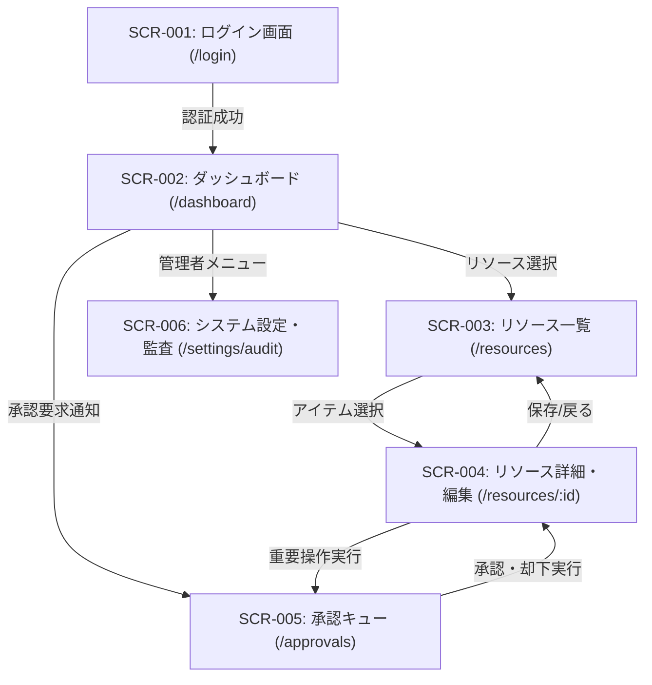
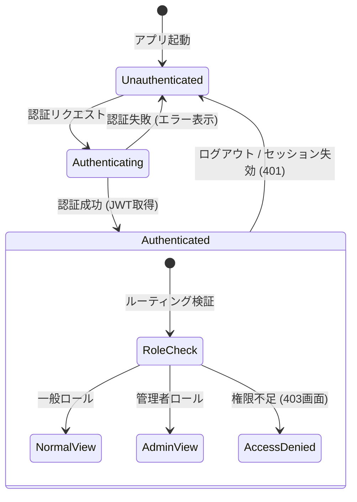

# 画面一覧 ＆ 画面遷移設計書

## 1. 概要と画面設計方針
- **目的**: ユーザーが操作する全画面の構成、ルーティング、ロール別アクセス権限、画面間遷移フローを可視化する。
- **画面遷移方針**:
  - 未認証ユーザーは認証ガードによりログイン画面へリダイレクト。
  - ロール（管理者 / 一般 / テナント管理者）に応じた動的ナビゲーション制御。
  - セッション失効時は直前ページを保持して再ログイン後に復帰。

---

## 2. 画面一覧マトリクス

| 画面ID | 画面名 | パス (URL Route) | 対象ロール | 概要・主要機能 |
| :--- | :--- | :--- | :--- | :--- |
| `SCR-001` | ログイン画面 | `/login` | 未認証・全ロール | 認証情報入力、SSO連携ボタン、多要素認証（MFA）入力 |
| `SCR-002` | ダッシュボード | `/dashboard` | 認証済み全ユーザー | KPI指標表示、最近のアクティビティ一覧、クイックアクション |
| `SCR-003` | データ管理一覧 | `/resources` | 一般ユーザー / 管理者 | リソース検索・絞り込み・ページネーション、新規作成ボタン |
| `SCR-004` | データ詳細・編集 | `/resources/[id]` | 一般ユーザー / 管理者 | リソース詳細表示、編集フォーム、削除アクション（HITL対象） |
| `SCR-005` | HITL承認キュー | `/approvals` | 承認者 / 管理者 | AIエージェントおよび重要変更の保留アクション確認・承認/却下 |
| `SCR-006` | システム設定・監査 | `/settings/audit` | システム管理者 | テナント設定、監査ログ検索・エクスポート |

---

## 3. 画面遷移図 (Screen Flow)

---

## 4. 共通ステートマシン（認証 ＆ ルーティングガード）

