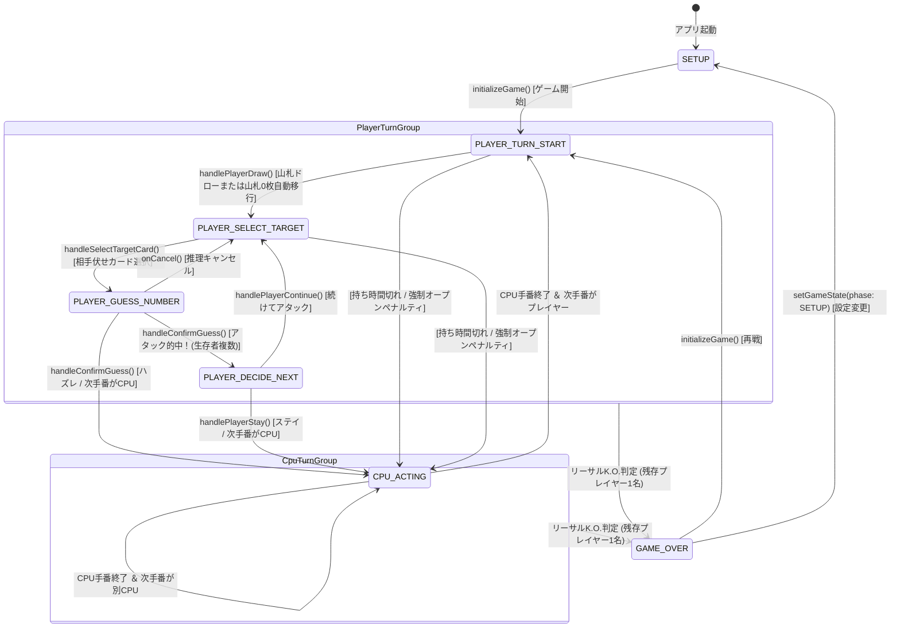

# 画面一覧 ＆ 画面遷移設計書: アルゴ（algo）Web対戦システム

## 1. 概要と画面設計方針

- **目的**: アルゴ（algo）Web対戦システムにおける全画面構成、モーダル表示、ゲームステートマシン、および画面間遷移フローを可視化する。
- **画面設計方針**:
  - **Single Page Application (SPA) アーキテクチャ**:
    - Next.js 15+ App Router（`/`）の単一ページ上で、`GameState.phase`（ゲーム状態）およびモーダル管理Stateに連動してUIコンポーネントおよびモーダルを動的に切り替える。
    - 画面リロードなしで高速かつシームレスに対戦・推理が進行する体験を提供。
  - **直感的な手番ガイダンス**:
    - プレイヤーの手番状況（ドロー待ち、対象選択中、推理中、継続/ステイ選択、CPU思考中）を中央テーブルのインフォメーションエリアおよびアニメーション演出（脈動パルス、バウンス等）で常に明確に指示。
  - **モーダル駆動の論理思考インターフェース**:
    - 数字推理（アタック）、ルール確認、初期セットアップ、HITL（操作ガード）、AIヒント、残弾トラッカーHUD、戦績確認、チュートリアル、決着演出は独立モーダル/HUDとしてオーバーレイ表示し、思考に必要な情報（確認済み数字、対象カード位置、未確定残弾）に集中できるレイアウトを採用。

---

## 2. 画面・モーダル一覧マトリクス

| 画面/モーダルID | 画面・モーダル名 | パス / 表示形式 | 主要コンポーネント | 役割・主要機能 |
| :--- | :--- | :--- | :--- | :--- |
| `SCR-001` | ゲームセットアップ画面 | `/` (初期表示 / phase: `SETUP`) | `SetupModal` | ニックネーム設定（`input-nickname`）、対戦相手Rosterプレビュー、対戦人数（2〜4人）、持ち時間（30秒/15秒/無制限）、CPU難易度（初級/中級/上級）の選択、戦績・サウンドトグル、バージョン表示、対戦開始 |
| `SCR-002` | メイン対戦盤面 | `/` (対戦中全般) | `GameBoard`, `CardComponent` | 対戦相手の手札エリア、中央テーブル（山札・引いたカード・手番ガイド）、プレイヤー手札エリア、上部ヘッダー（サウンドトグル、タイマー、モバイルメニュー `☰` ドロップダウン、モバイルFABボタン） |
| `SCR-003` | ルール解説モーダル | モーダル表示 (全フェーズ対応) | `RuleGuideModal` | アルゴ公式ルールの解説（並び順規約、初期手札、手番フロー、勝利条件）をいつでもオーバーレイ表示 |
| `SCR-004` | アタック・数字推理モーダル | モーダル表示 (phase: `PLAYER_GUESS_NUMBER`) | `AttackModal` | ターゲットカード情報、0〜11の数字選択グリッド、確認済み数字グレーアウト、候補数字アシスト表示（バッジ、失策数字グレーアウト、トラッカー残弾連動）、アタック確定 |
| `SCR-005` | 継続・ステイ選択パネル | インラインUI (phase: `PLAYER_DECIDE_NEXT`) | `GameBoard` (中央テーブル内) | アタック的中後の選択肢提供（「続けてアタック」または「ステイ（引いたカードを手札に加えて手番終了）」） |
| `SCR-006` | 対戦ログパネル | 画面右側（PC）/ 下部（スマホ）常時表示 | `GameLog` | 各ターンの推理結果（的中/ハズレ、推理数字、オープン情報）のリアルタイム履歴表示 |
| `SCR-007` | 決着リザルトモーダル | 独立モーダル表示 (phase: `GAME_OVER`) | `ResultModal`, `ConfettiEffect` | 勝者判定・完全勝利/敗北メッセージ、戦績サマリ、手札の答え合わせ（Review Hands セクションで全員の伏せカードを完全開示）、紙吹雪演出、再戦/設定復帰ボタン |
| `SCR-008` | HITL確認モーダル | モーダル表示 (ユーザー操作時) | `ConfirmModal` (HITL Guard) | 進行中の対戦リセット（再戦）、設定画面への復帰、投了（ギブアップ）時の誤操作防止確認 |
| `SCR-009` | プレイヤーアタック結果モーダル | モーダル表示 (プレイヤーアタック後) | `AttackResultModal` | プレイヤーのアタック成否（的中/ハズレ）、引いたカードの開示・収納、手番継続/ステイ遷移の通知案内（Space/Enterキー対応） |
| `SCR-010` | CPUアタック演出モーダル | モーダル表示 (CPUアタック後) | `CpuAttackModal` | CPUのアタック成否演出、脱落後の観戦モード自動進行タイマー（1500msディレイ）および一括スキップ機能 |
| `SCR-011` | AIヒントアドバイザー | モーダル表示 (手番中随時呼出可) | `HintModal` | 1対戦1回制限のAIアドバイス。論理的確定マス（100%的中）または最善手候補・的中率の提示（持ち時間警告連動） |
| `SCR-012` | リーサルK.O.演出 | 全画面ダイナミック演出 (決着ヒット時) | `LethalCutIn` | 相手の最後の伏せカード的中時に全画面で発動する「💥 FINISH!!」ダイナミックカットイン演出（光彩・パーティクル、自動/クリック消去） |
| `SCR-013` | 残弾トラッカーHUD | デスクトップ常時/モバイルボトムドロワー | `DeckTracker` | 全24枚（黒0〜11、白0〜11）のオープン状況・手札・残弾の一覧HUD。アタック対象選択時の候補連動ハイライト表示 |
| `SCR-014` | 通算戦績＆実績モーダル | モーダル表示 (ヘッダー/セットアップ) | `StatsModal` | 通算試合数、勝率、連勝記録、的中率、難易度別勝敗、全10大アチーブメントトロフィー一覧、戦績リセット機能 |
| `SCR-015` | 対話型チュートリアルモーダル | モーダル表示 (ヘッダー/初回呼出) | `TutorialModal` | 基本ルールからドロー、並び順、アタック、ステイまでを実践形式で学べる6ステップ対話型インタラクティブチュートリアル |
| `SCR-016` | チュートリアルプロンプトモーダル | モーダル表示 (初回起動時判定) | `TutorialPromptModal` | 初回訪問プレイヤーへチュートリアル受講を促すプロンプトモーダル（「次回から表示しない」チェック付き） |
| `SCR-017` | システムエラー境界フォールバック | 全画面オーバーレイ (予期せぬ例外時) | `ErrorBoundary` | Reactランタイムエラー捕捉、監査イベント `CLIENT_CRASH` 発火、フォールバックUI表示、ページ再読み込み/安全復帰ボタン |

---

## 3. 画面遷移図 (Screen Flow)

```mermaid
flowchart TD
    classDef modal fill:#EEF4FD,stroke:#7BA6EF,stroke-width:2px;
    classDef board fill:#FAF9F5,stroke:#1E2A44,stroke-width:2px;
    classDef action fill:#FEFDDB,stroke:#FCF97A,stroke-width:2px;
    classDef alert fill:#FFF1F2,stroke:#F43F5E,stroke-width:2px;
    classDef cutin fill:#FEE2E2,stroke:#EF4444,stroke-width:3px;

    Start([アプリ起動]) --> CheckInit{初回起動判定}
    CheckInit -->|初回| SCR016["SCR-016: チュートリアル確認<br>(TutorialPromptModal)"]:::modal
    CheckInit -->|2回目以降| SCR001["SCR-001: セットアップ画面<br>(SetupModal)"]:::modal

    SCR016 -->|「チュートリアルを始める」| SCR015["SCR-015: 対話型チュートリアル<br>(TutorialModal)"]:::modal
    SCR016 -->|「スキップ」| SCR001
    SCR015 -->|チュートリアル完了/閉じる| SCR001

    SCR001 -->|ルール確認| SCR003["SCR-003: ルール解説モーダル<br>(RuleGuideModal)"]:::modal
    SCR003 -->|閉じる| SCR001
    SCR001 -->|戦績確認| SCR014["SCR-014: 戦績＆実績モーダル<br>(StatsModal)"]:::modal
    SCR014 -->|閉じる| SCR001
    SCR001 -->|チュートリアル起動| SCR015

    SCR001 -->|「対戦を開始する！」| SCR002["SCR-002: メイン対戦盤面<br>(GameBoard)"]:::board

    subgraph HeaderAndHUD["盤面補助・ヘッダー導線"]
        SCR002 -.->|ヘッダー/FAB| SCR013["SCR-013: 残弾トラッカー<br>(DeckTracker HUD)"]:::modal
        SCR002 -.->|AIヒントボタン| SCR011["SCR-011: AIヒントアドバイザー<br>(HintModal)"]:::modal
        SCR011 -.->|閉じる/対象選択連動| SCR002
        SCR002 -.->|ルール| SCR003
        SCR002 -.->|戦績| SCR014
        SCR002 -.->|再戦/設定| SCR008["SCR-008: HITL確認モーダル<br>(ConfirmModal)"]:::alert
        SCR008 -.->|キャンセル| SCR002
        SCR008 -.->|設定へ戻る確定| SCR001
    end

    subgraph InGame["メイン対戦ループ"]
        SCR002 -->|山札クリック (ドロー)| Draw["山札からドロー (山札0枚時はスキップ)"]:::action
        Draw --> SelectCard["相手の伏せカードを選択"]:::action
        SelectCard --> SCR004["SCR-004: 数字推理モーダル<br>(AttackModal)"]:::modal

        SCR004 -->|キャンセル| SCR002
        SCR004 -->|数字を選択してアタック| SCR009["SCR-009: アタック結果通知<br>(AttackResultModal)"]:::modal

        SCR009 -->|判定確認| CheckResult{"アタック結果判定"}
        CheckResult -->|【的中】残存あり| SCR005["SCR-005: 継続/ステイ選択<br>(PLAYER_DECIDE_NEXT)"]:::action
        CheckResult -->|【的中】リーサル（相手全滅）| SCR012["SCR-012: リーサルK.O.演出<br>(LethalCutIn)"]:::cutin
        CheckResult -->|【ハズレ】引いたカードOPEN| Penalty["ペナルティ反映<br>手札にOPEN追加"]:::action

        SCR005 -->|「続けてアタック」| SelectCard
        SCR005 -->|「ステイ」引いたカードを伏せて追加| CPULoop["相手（CPU）の手番<br>(CPU_ACTING)"]:::action
        Penalty --> CPULoop

        CPULoop -->|CPUドロー ＆ 思考・アタック| SCR010["SCR-010: CPUアタック演出<br>(CpuAttackModal)"]:::modal
        SCR010 -->|確認 / 観戦自動進行| CPUEval{"CPU推理結果"}
        CPUEval -->|的中 ＆ リーサル| SCR012
        CPUEval -->|的中 ＆ 継続/ステイ| NextCheck{"生存プレイヤー確認"}
        CPUEval -->|ハズレ ＆ オープン| NextCheck

        NextCheck -->|生存者2名以上| SCR002
        SCR012 -->|演出終了/スキップ| SCR007["SCR-007: 決着リザルトモーダル<br>(ResultModal / Confetti)"]:::modal
    end

    SCR007 -->|「もう一度対戦する」| SCR002
    SCR007 -->|「設定へ戻る」| SCR001
```

---

## 4. ゲームステートマシン (Game Phase State Machine)

アルゴの対戦フローは、型定義 `GamePhase` に連動した厳格な有限ステートマシンとして設計・実装されています。



### 4.1 各フェーズ（GamePhase）の詳細定義

| フェーズ名 (`GamePhase`) | トリガー条件 | 許可されるユーザー操作 | 次の遷移先フェーズ |
| :--- | :--- | :--- | :--- |
| `SETUP` | アプリ初期起動時、または対戦終了後の設定ボタン押下時 | ニックネーム設定、対戦人数選択、持ち時間選択、CPU難易度選択、ルール閲覧、チュートリアル、戦績確認、サウンドトグル、対戦開始 | `PLAYER_TURN_START` |
| `PLAYER_TURN_START` | 人間プレイヤーの手番開始時 | 山札をクリックしてドロー（山札が0枚の場合は自動遷移）、AIヒント呼出、残弾トラッカーHUD確認、ルール確認、再戦・設定 | `PLAYER_SELECT_TARGET` |
| `PLAYER_SELECT_TARGET` | ドロー完了後、または的中後の「続けてアタック」選択時 | 相手の手札の裏向きカード（`?`）をクリック選択、AIヒント呼出、残弾トラッカーHUD確認、ルール確認 | `PLAYER_GUESS_NUMBER` |
| `PLAYER_GUESS_NUMBER` | 相手の裏向きカード選択後 | 0〜11の数字ボタン選択（候補アシスト・残弾連動バッジ・失策グレーアウト表示）、アタック確定ボタン、モーダルキャンセル | `PLAYER_DECIDE_NEXT`（的中・残存あり）<br>`CPU_ACTING`（ハズレ）<br>`GAME_OVER`（リーサル的中・決着） |
| `PLAYER_DECIDE_NEXT` | プレイヤーのアタックが的中した直後 | 「続けてアタック」ボタン（再推理）、または「ステイ」ボタン（引いたカードを手札に加えて手番終了） | `PLAYER_SELECT_TARGET`（継続）<br>`CPU_ACTING`（ステイ） |
| `CPU_ACTING` | CPUの手番（1体〜複数体順次実行） | 閲覧のみ（盤面操作はロック、CPUアタック演出モーダル `CpuAttackModal` 表示、観戦モード自動進行/スキップ） | `PLAYER_TURN_START`（人間手番）<br>`CPU_ACTING`（別CPU手番）<br>`GAME_OVER`（決着） |
| `GAME_OVER` | いずれかの手番で生存プレイヤーが残り1名になった瞬間（リーサル演出後） | 決着リザルトモーダル（`ResultModal`）表示、手札の答え合わせ（Review Hands）確認、「もう一度対戦する（再戦）」ボタン、「設定へ戻る」ボタン | `PLAYER_TURN_START`（再戦）<br>`SETUP`（設定） |

### 4.2 例外・タイムアウト処理規約
- **持ち時間切れ時の強制遷移**:
  - `PLAYER_TURN_START` または `PLAYER_SELECT_TARGET` 状態でタイマーが0秒に達した場合、山札（または引いたカード）が強制的に表向き（`isOpen = true`）で手札に挿入され、即座に手番が次プレイヤー（`CPU_ACTING` 等）へ遷移する。山札枯渇時は手札の伏せカードがオープンされる。
- **山札0枚時の手番開始**:
  - 山札残数が0枚の場合、`PLAYER_TURN_START` からドロー処理をスキップし、手札ドローなしのまま直ちに `PLAYER_SELECT_TARGET` へ自動移行する。的中後のステイ時は新規カード追加なしで手番が終了する。
