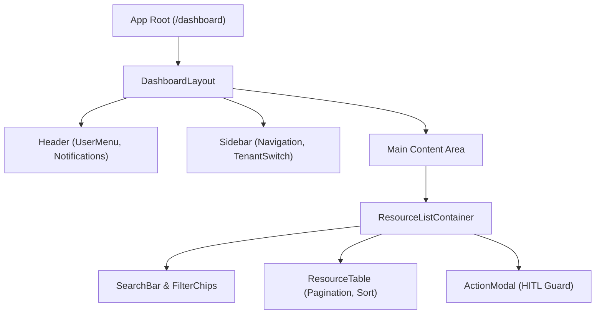

# UI仕様 ＆ 画面詳細設計書

## 1. UI設計標準とコンポーネント構成
- **デザインシステム**: Tailwind CSS ＋ デザインコンポーネント集（shadcn/ui または MUI）
- **レスポンシブ要件**: Desktop (1280px以上), Tablet (768px〜1279px), Mobile (375px〜767px)
- **状態管理方針**:
  - **Server State**: TanStack Query (React Query) / SWR（キャッシュ、再検証、楽観的更新）
  - **Global Client State**: Zustand / Jotai（ユーザーセッション、テーマ、承認モーダル状態）
  - **Local State**: React `useState` / `useReducer`（開閉フラグ、ローカル入力値）
  - **Form Management**: React Hook Form ＋ Zod（クライアントサイドスキーマ検証）

---

## 2. コンポーネント階層構造 (Component Tree)



---

## 3. 主要画面仕様例：リソース作成・編集画面 (`SCR-004`)

### 3.1 画面レイアウト（ワイヤーフレーム概要）
```text
+---------------------------------------------------------------+
| Header: [Logo]   [Tenant: ACME Corp]   [Bell (2)]  [Avatar v] |
+---------------------------------------------------------------+
| Sidebar | Breadcrumb: Home > Resources > New                  |
| - Home  |-----------------------------------------------------|
| - Items | [Title: Create Resource                           ] |
| - Queue |                                                     |
| - Admin | Field 1: Name *       [ Input text                ] |
|         | Field 2: Category *   [ Select dropdown         v ] |
|         | Field 3: Scope        (o) Internal  ( ) Public      |
|         | Field 4: Description  [ Multiline textarea        ] |
|         |                                                     |
|         | [ Cancel ]                         [ Submit (Save) ]|
+---------------------------------------------------------------+
```

### 3.2 入力フォーム・バリデーション定義

| 項目名 | 論理名 | UIコンポーネント | 型・制約 | 必須 | バリデーションルール・エラーメッセージ |
| :--- | :--- | :--- | :--- | :---: | :--- |
| `name` | リソース名 | Text Input | string (1〜100文字) | ○ | 空白不可。「リソース名は1〜100文字以内で入力してください」 |
| `category` | カテゴリ | Select Dropdown | enum (`TECH`, `OPS`, `FIN`) | ○ | 選択必須。「カテゴリを1つ選択してください」 |
| `scope` | 公開範囲 | Radio Group | enum (`INTERNAL`, `PUBLIC`) | ○ | デフォルトは `INTERNAL` |
| `description` | 説明 | Textarea | string (最大500文字) | × | 最大500文字。「説明は500文字以内で入力してください」 |
| `tags` | タグ | Tag Input Chips | string[] (最大5件) | × | 英数字およびハイフンのみ許容 |

---

## 4. エラー表示 ＆ ユーザーフィードバック仕様
- **インラインエラー**: 各入力フィールド直下に赤字（`text-destructive`）で即座に表示（`onChange` または `onBlur` 検証）。
- **トースト通知**: 非同期通信成功時（緑）およびサーバー起因のエラー時（赤）に画面右上へ3秒間トースト表示。
- **ローディング状態**: ボタン内にスピナー表示 ＆ ボタン無効化（`disabled`）により二重送信を防止。
