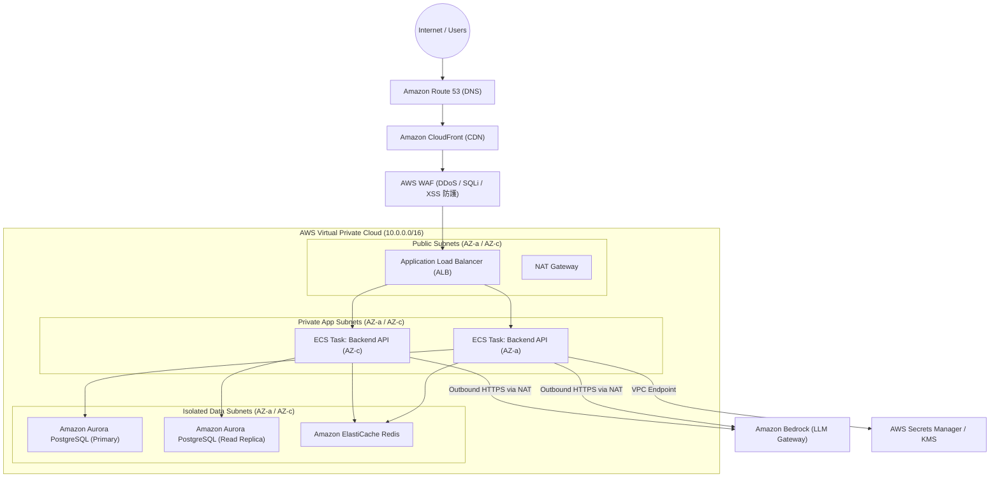

# クラウドインフラ全体構成図 ＆ 方式設計書

## 1. インフラ基本設計方針
- **採用クラウド**: Amazon Web Services (AWS)
- **高可用性方針**: Multi-AZ (Availability Zone) 構成による単一障害点（SPOF）の排除
- **スケーラビリティ**: コンテナワークロード（AWS Fargate）のオートスケーリング
- **セキュリティ・境界防御**: AWS WAF、VPC Private Subnetによるパブリック通信の完全遮断

---

## 2. クラウドインフラ全体構成図 (AWS Architecture)

---

## 3. 主要コンポーネント選定 ＆ サイジング一覧

| レイヤー | 採用AWSサービス | 冗長化構成 | 選定理由 ＆ スペック概要 |
| :--- | :--- | :--- | :--- |
| **DNS / CDN** | Route 53 ＋ CloudFront | グローバルエッジ | 静的アセットキャッシュ、TLS終端、DDoS緩和 |
| **WAF** | AWS WAF | CloudFront / ALB 連携 | AWSマネージドルール（OWASP Top 10、不正IPブロック） |
| **ロードバランサー**| Application Load Balancer (ALB)| Multi-AZ (クロスゾーン負荷分散)| HTTP/2終端、パスベースルーティング、SSL証明書管理 |
| **コンテナ実行基盤**| AWS ECS on Fargate | Multi-AZ (Min: 2タスク) | サーバーレスコンテナ、パッチ管理不要、CPU/メモリ独立拡張 |
| **データベース** | Amazon Aurora PostgreSQL | Multi-AZ (1 Writer + 1 Reader) | 自動フェイルオーバー（<30秒）、PITR対応、高性能スケーリング |
| **キャッシュ** | Amazon ElastiCache (Redis) | Multi-AZ (プライマリ＋レプリカ)| セッションキャッシュ、レートリミット高速判定 |
| **AI基盤** | Amazon Bedrock | マネージドモデル呼び出し | Claude / Titan等の利用、Guardrailsによる安全フィルタリング |
| **シークレット管理**| AWS Secrets Manager ＋ KMS | Multi-Region レプリケーション可能 | DB認証情報自動ローテーション、エンベロープ暗号化 |
