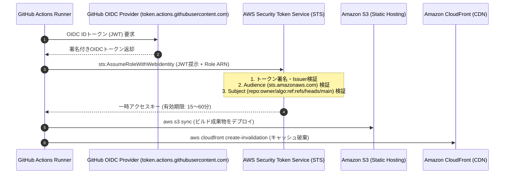

# インフラ IAM ＆ 最小権限ポリシー設計書 (IAM Least Privilege Spec)

本設計書は、「アルゴ（algo）Web対戦システム」におけるAWS IAM（Identity and Access Management）ロールおよびポリシーの設計を定義します。
セキュリティ・ガバナンス基準（`@.agents/rules/agent-security-governance.md`）に準拠し、**長期アクセスキー（AK/SK）の完全排除**、**GitHub Actions OIDC認証による一時クレデンシャル利用**、および**ワイルドカード（`*`）を徹底排除した最小権限ポリシー**を策定します。

---

## 1. IAM設計基本方針

1. **ゼロクレデンシャルCI/CD（GitHub Actions OIDC）**:
   - GitHubのSecretsにAWSアクセスキー・シークレットアクセスキーを永続保存することを禁止。
   - GitHub OpenID Connect (OIDC) IDプロバイダとAWS IAM Roleを連携し、ワークフロー実行時のみ短命（1時間以内）の一時セキュリティトークン（STS AssumeRoleWithWebIdentity）を発行。
2. **ワイルドカード（`Resource: *` や `Action: *`）の厳格排除**:
   - `s3:*` や `cloudfront:*` のような包括的アクション指定、および `Resource: "*"` の包括的リソース指定を完全排除。
   - 操作可能なS3バケット名、CloudFront Distribution ARN、将来のDynamoDBテーブルARNを明示的に指定。
3. **ブランチ・リポジトリスコープの制限 (Condition Blocks)**:
   - IAMロールの引き受けを、特定リポジトリの特定ブランチ（例: `repo:owner/algo:ref:refs/heads/main`）からの実行にのみ制限し、フォークや他ブランチからの不正デプロイを阻止。

---

## 2. GitHub Actions OIDC 連携アーキテクチャ



---

## 3. OIDC信頼関係ポリシー (Trust Relationship)

GitHub Actionsがデプロイ用IAMロールを引き受けるための信頼ポリシーです。
特定リポジトリ（例: `your-org/algo`）の `main` ブランチからの実行のみを許可します：

```json
{
  "Version": "2012-10-17",
  "Statement": [
    {
      "Sid": "AllowGitHubActionsOIDCAssumeRole",
      "Effect": "Allow",
      "Principal": {
        "Federated": "arn:aws:iam::123456789012:oidc-provider/token.actions.githubusercontent.com"
      },
      "Action": "sts:AssumeRoleWithWebIdentity",
      "Condition": {
        "StringEquals": {
          "token.actions.githubusercontent.com:aud": "sts.amazonaws.com"
        },
        "StringLike": {
          "token.actions.githubusercontent.com:sub": "repo:your-org/algo:ref:refs/heads/main"
        }
      }
    }
  ]
}
```

---

## 4. デプロイ用最小権限IAMポリシー (GitHub Actions Deploy Policy)

デプロイに必要な操作（S3への静的アセット同期、CloudFrontのキャッシュ無効化）のみを許可し、他リソースへのアクセスやバケット削除などの破壊的操作を完全に排除します：

```json
{
  "Version": "2012-10-17",
  "Statement": [
    {
      "Sid": "S3StaticBucketSyncList",
      "Effect": "Allow",
      "Action": [
        "s3:ListBucket",
        "s3:GetBucketLocation"
      ],
      "Resource": "arn:aws:s3:::algo-prod-apne1-static-hosting-123456789012"
    },
    {
      "Sid": "S3StaticBucketObjectOperations",
      "Effect": "Allow",
      "Action": [
        "s3:PutObject",
        "s3:GetObject",
        "s3:DeleteObject"
      ],
      "Resource": "arn:aws:s3:::algo-prod-apne1-static-hosting-123456789012/*"
    },
    {
      "Sid": "CloudFrontInvalidateCache",
      "Effect": "Allow",
      "Action": [
        "cloudfront:CreateInvalidation",
        "cloudfront:GetInvalidation"
      ],
      "Resource": "arn:aws:cloudfront::123456789012:distribution/E1234EXAMPLE56"
    }
  ]
}
```

> [!NOTE]
> 上記の通り、`s3:DeleteBucket` や `cloudfront:DeleteDistribution` などの破滅的インフラ操作権限は一切含まれていません。これにより、万一CI/CDスクリプトに不具合があった場合でも基盤が損なわれることはありません。

---

## 5. 将来拡張時（Phase 2）の最小権限設計

Phase 2 で Lambda / DynamoDB / Cognito を導入する際も、各実行ロールごとにリソースARNを特定して分離します：

| ロール名 | 主体 (Principal) | 付与する最小アクション | 対象リソースARN |
| :--- | :--- | :--- | :--- |
| `algo-lambda-game-role` | `lambda.amazonaws.com` | `dynamodb:GetItem`<br>`dynamodb:PutItem`<br>`dynamodb:UpdateItem`<br>`dynamodb:DeleteItem` | `arn:aws:dynamodb:ap-northeast-1:123456789012:table/algo-prod-rooms`<br>`arn:aws:dynamodb:ap-northeast-1:123456789012:table/algo-prod-match-histories` |
| `algo-lambda-logs-role` | `lambda.amazonaws.com` | `logs:CreateLogGroup`<br>`logs:CreateLogStream`<br>`logs:PutLogEvents` | `arn:aws:logs:ap-northeast-1:123456789012:log-group:/aws/lambda/algo-prod-*` |
| `algo-api-gateway-invoke-role` | `apigateway.amazonaws.com` | `lambda:InvokeFunction` | `arn:aws:lambda:ap-northeast-1:123456789012:function:algo-prod-*` |

---

## 6. 初期セットアップ手順（Phase 0-C 人間依頼テンプレート）

クラウド管理者（人間）は、以下のAWS CLIコマンドによりOIDCプロバイダおよびIAMロールを作成します：

```bash
# 1. GitHub OIDC プロバイダ作成（未登録の場合のみ）
aws iam create-open-id-connect-provider \
  --url "https://token.actions.githubusercontent.com" \
  --client-id-list "sts.amazonaws.com" \
  --thumbprint-list "6938fd4d98bab03faadb97b34396831e3780aea1" "1c58a3a8518e8759bf075b76b750d4f8d264fcd3"

# 2. デプロイ用IAMロールの作成（信頼ポリシー適用）
aws iam create-role \
  --role-name algo-github-deploy-role \
  --assume-role-policy-document file://infrastructure/iam/github-oidc-trust-policy.json

# 3. 最小権限デプロイポリシーのアタッチ
aws iam put-role-policy \
  --role-name algo-github-deploy-role \
  --policy-name algo-s3-cloudfront-deploy-policy \
  --policy-document file://infrastructure/iam/deploy-least-privilege-policy.json
```
