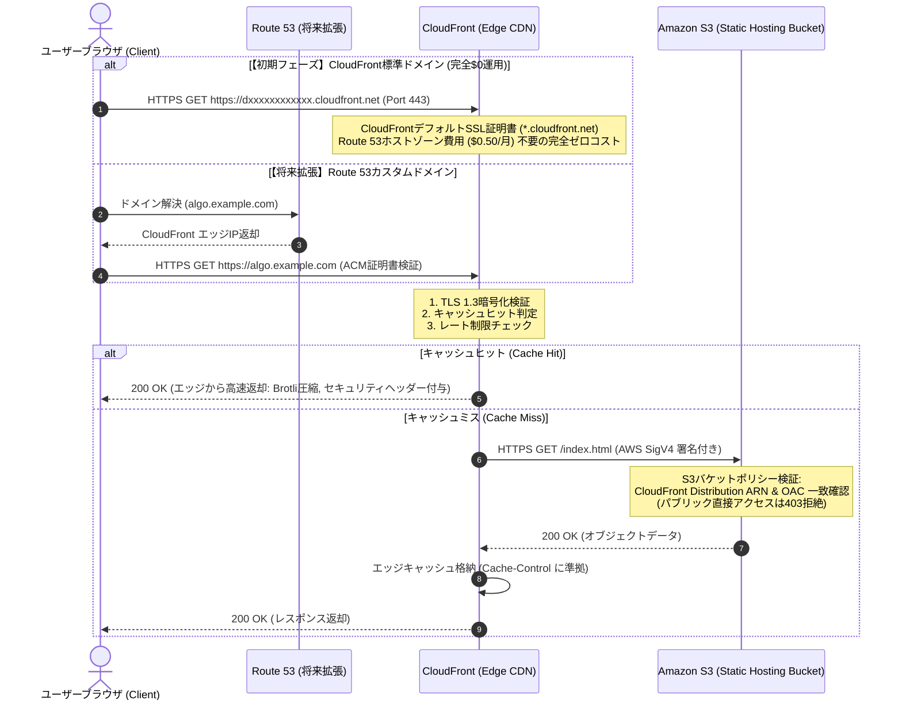

# インフラ ネットワーク ＆ 通信経路設計書 (Network Spec)

本設計書は、「アルゴ（algo）Web対戦システム」におけるネットワーク通信経路、アクセス制御境界、およびセキュリティ通信ポリシーを定義します。
AWS S3への直接アクセスを完全遮断し、CloudFrontエッジを経由した厳格なHTTPS通信のみを許可する堅牢なゼロトラストネットワークを構築します。

---

## 1. 通信経路アーキテクチャ概要

本システムでは、パブリックなS3静的ウェブサイトホスティング（ウェブサイトエンドポイント）を使用せず、**CloudFront Origin Access Control (OAC)** を利用したプライベートS3構成を採用します。



---

## 2. CloudFront OAC (Origin Access Control) 設計

### 2.1 S3パブリックアクセスの完全遮断 (Block Public Access)
S3バケットでは「パブリックアクセスのブロック」の全4項目を有効（`true`）化し、インターネットから直接S3オブジェクトを取得することを物理的に不可能にします：
- `BlockPublicAcls: true`
- `IgnorePublicAcls: true`
- `BlockPublicPolicy: true`
- `RestrictPublicBuckets: true`

### 2.2 S3バケットポリシー設計（OAC限定許可）
CloudFront Distribution からの AWS Signature Version 4 (SigV4) 署名付きリクエストのみを許可するバケットポリシーを適用します：

```json
{
  "Version": "2012-10-17",
  "Statement": [
    {
      "Sid": "AllowCloudFrontServicePrincipalReadOnly",
      "Effect": "Allow",
      "Principal": {
        "Service": "cloudfront.amazonaws.com"
      },
      "Action": "s3:GetObject",
      "Resource": "arn:aws:s3:::algo-prod-static-hosting/*",
      "Condition": {
        "StringEquals": {
          "AWS:SourceArn": "arn:aws:cloudfront::123456789012:distribution/E1234EXAMPLE56"
        }
      }
    }
  ]
}
```

---

## 3. HTTPS強制 ＆ 暗号化通信ポリシー

### 3.1 ビューワープロトコルポリシー (Viewer Protocol Policy)
- **設定値**: `redirect-to-https`
- すべてのHTTP（Port 80）リクエストは、CloudFrontエッジにて即座にHTTPS（Port 443）へ301恒久転送されます。

### 3.2 TLS / SSL プロトコルバージョン
- **最小TLSバージョン**: `TLSv1.2_2021`（または推奨の `TLSv1.3`）
- 脆弱性のある SSLv3, TLS 1.0, TLS 1.1 は完全無効化。
- **暗号スイート**: 前方秘匿性（Forward Secrecy）およびAEAD暗号（AES-GCM, CHACHA20-POLY1305）を強制。

---

## 4. レスポンスヘッダー ＆ セキュリティポリシー (Response Headers Policy)

CloudFront の「マネージド・レスポンスヘッダーポリシー（SecurityHeadersPolicy）」またはカスタムポリシーを全レスポンスに注入し、ブラウザ側のセキュリティを機械的に強制します：

| ヘッダー名 | 設定値 | セキュリティ目的 |
| :--- | :--- | :--- |
| **Strict-Transport-Security** (HSTS) | `max-age=63072000; includeSubDomains; preload` | 最低2年間のHTTPS強制（中間者攻撃・SSL Strip防止） |
| **X-Content-Type-Options** | `nosniff` | MIMEタイプスニッフィングによるスクリプト不正実行防止 |
| **X-Frame-Options** | `DENY` | クリックジャッキング防止（他サイトのiframe内埋め込み完全禁止） |
| **Referrer-Policy** | `strict-origin-when-cross-origin` | 外部サイト遷移時のリファラ情報（URLパラメータ漏洩）制御 |
| **Permissions-Policy** | `camera=(), microphone=(), geolocation=()` | 不要なブラウザAPIアクセスの無効化 |
| **Content-Security-Policy** (CSP) | `default-src 'self'; script-src 'self' 'unsafe-inline'; style-src 'self' 'unsafe-inline'; img-src 'self' data:; connect-src 'self'; font-src 'self';` | XSS（クロスサイトスクリプティング）および悪意ある外部通信の完全阻止 |

---

## 5. CORS (Cross-Origin Resource Sharing) 設計

### 5.1 静的アセット配信用
- 同一オリジン配信を基本とするため、静的ファイルに対するCORSは原則不許可。
- WebフォントやSVGアイコン等をサブドメイン間で共有する場合のみ、厳密に許可オリジンを限定：
  ```json
  [
    {
      "AllowedHeaders": ["*"],
      "AllowedMethods": ["GET", "HEAD"],
      "AllowedOrigins": ["https://algo.example.com"],
      "MaxAgeSeconds": 86400
    }
  ]
  ```

### 5.2 将来拡張（Phase 2: API Gateway / WebSocket）
- API Gateway におけるCORS設定：
  - `Access-Control-Allow-Origin`: `https://algo.example.com`（ワイルドカード `*` ではなく本番ドメインを固定）
  - `Access-Control-Allow-Methods`: `GET, POST, OPTIONS`
  - `Access-Control-Allow-Headers`: `Content-Type, Authorization, X-Requested-With`
  - `Access-Control-Max-Age`: `3600`（プリフライトリクエストの無駄な通信削減）

---

## 6. ドメインおよびSSL/TLS証明書設計方針

| フェーズ | 採用ドキュメント・URL | SSL/TLS証明書 | コスト影響 | 備考 |
| :--- | :--- | :--- | :--- | :--- |
| **初期運用（Phase 0〜Phase 1）** | **CloudFront標準ドメイン**<br>`https://<distribution-id>.cloudfront.net` | **CloudFront Default Certificate**<br>（Amazon CloudFront標準証明書 `*.cloudfront.net`） | **完全 $0 (無料)**<br>Route 53 ホストゾーン費用（$0.50/月）およびドメイン取得費が一切発生しない | ゼロコスト運用を徹底。<br>CloudFormation/Terraformで即時プロビジョニング可能。 |
| **将来拡張（Phase 2以降）** | **独自カスタムドメイン**<br>例: `https://algo.yourdomain.com` | **AWS Certificate Manager (ACM)**<br>（us-east-1 で発行された無料パブリックSSL証明書） | Route 53 ホストゾーン（$0.50/月）＋ ドメイン更新料（年額実費） | プレイヤー認知度向上・ブランディング時に移行。CloudFrontのエイリアス設定でシームレスに切り替え可能。 |
