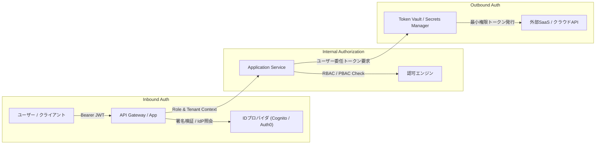

# セキュリティ 認証・認可設計書 (Inbound / Outbound Auth)

## 1. 認証・認可アーキテクチャ概要
本システムでは、外部からのエージェント/API呼び出しを安全に制御する **Inbound Auth** と、エージェントが外部SaaSや社内リソースにアクセスする際の安全な認証情報管理を行う **Outbound Auth** を分離して設計します。



---

## 2. Inbound Auth（受信認証・認可）

### 2.1 トークンライフサイクル
- **Access Token**: JWT形式（RS256署名）、有効期限 15分（短命設計）。
- **Refresh Token**: 暗号化Cookie（`HttpOnly`, `Secure`, `SameSite=Strict`）、有効期限 7日間。
- **ペイロードクレーム**:
  ```json
  {
    "sub": "usr_01H1234567890",
    "iss": "https://auth.example.com",
    "aud": "https://api.example.com",
    "tenant_id": "tenant_acme",
    "roles": ["user"],
    "permissions": ["resource:read", "resource:write"],
    "exp": 1727500000,
    "iat": 1727499100
  }
  ```

### 2.2 ロール・権限マトリクス (RBAC)

| 操作 / リソース | 未認証 (`guest`) | 一般ユーザー (`user`) | 承認権限者 (`approver`) | システム管理者 (`admin`) |
| :--- | :---: | :---: | :---: | :---: |
| 認証トークン発行 | ○ | ○ | ○ | ○ |
| 自テナントリソース閲覧 | × | ○ | ○ | ○ |
| 自テナントリソース作成・編集 | × | ○ | ○ | ○ |
| リソース物理削除（HITL要求） | × | × | × | ○ (HITL承認後) |
| HITL承認キューの承認/却下 | × | × | ○ | ○ |
| 監査ログ検索・エクスポート | × | × | × | ○ |
| 他テナントの全データアクセス | × | × | × | × (完全禁止) |

---

## 3. Outbound Auth（送信認証・権限委任）
- **静的管理キーの排除**:
  - エージェントが外部APIにアクセスする際、全権管理者キー（Master API Key）を恒久的に共有することを厳禁とする。
- **Token Vault / Secrets Manager の活用**:
  - 外部APIへのアクセスは、Token Vault または AWS Secrets Manager 経由でオンデマンドに取得し、メモリ内にのみ一時展開する。
- **ユーザー委任スコープ**:
  - 操作を実行しているユーザー本人の権限スコープを超えた外部リクエストを禁止する（On-Behalf-Of トークン交換）。
