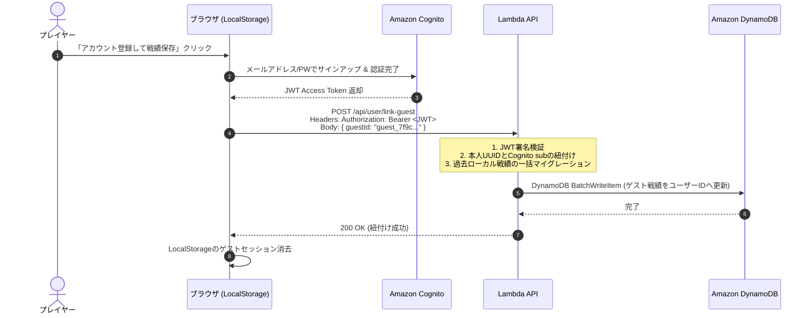

# セキュリティ 認証・認可設計書 (Auth Spec)

本設計書は、「アルゴ（algo）Web対戦システム」におけるプレイヤーの認証（Authentication）および認可（Authorization）のアーキテクチャを定義します。
手軽に遊べる**「完全匿名のゲストプレイ」**から、戦績保存・レーティング対戦が可能な**「Amazon Cognito によるアカウント認証」**まで、シームレスかつセキュアに両立するモデルを策定します。

---

## 1. 認証アーキテクチャ概要

```mermaid
flowchart TD
    Player["プレイヤー"] --> Choice{"プレイ形態の選択"}

    Choice -->|手軽に遊ぶ (登録不要)| Guest["1. 匿名ゲストプレイヤー<br>・クライアントUUID発行 (LocalStorage)<br>・CPU対戦 (即時プレイ可能)<br>・合言葉ルーム対戦 (ゲスト参加)"]
    Choice -->|本格的に遊ぶ (戦績・レート保存)| Auth["2. 認証済みプレイヤー<br>・Amazon Cognito User Pools<br>・メール/パスワード / ソーシャル<br>・JWTトークン (ID/Access/Refresh)"]

    Guest -.->|後からアカウント登録| Upgrade["アカウント昇格 (Account Upgrade)<br>・ゲスト時の一時対戦戦績を結合"]
    Upgrade -.-> Auth

    Auth --> API["Amazon API Gateway / WebSocket<br>・Cognito JWT オーソライザー<br>・戦績保存 & レートマッチング"]
    Guest --> CPU["フロントエンド単体実行 (Phase 1)<br>・完全クライアント完結 (通信不要)"]
```

---

## 2. プレイヤーロール ＆ 認可マトリクス (RBAC)

システムにおけるロールを以下の4種類に分類し、操作権限を厳格に制御します：

1. **ゲスト (`guest`)**: アカウント未登録の匿名プレイヤー。UUID（一時ID）で識別。
2. **登録ユーザー (`user`)**: Amazon Cognito で認証済みの正規プレイヤー。戦績・レートをクラウドに永続化。
3. **ルームホスト (`room_host`)**: オンライン対戦ルームを作成したプレイヤー（ゲスト/登録ユーザー問わず当該ルーム内でのみ有効）。
4. **システム管理者 (`admin`)**: 不正ユーザーBANや全体メンテナンスアナウンス権限を持つ管理者。

| 操作 / リソース | ゲスト (`guest`) | 登録ユーザー (`user`) | ルームホスト (`room_host`) | システム管理者 (`admin`) |
| :--- | :---: | :---: | :---: | :---: |
| **CPU対戦プレイ (全難易度)** | ○ | ○ | ○ | ○ |
| **ルール閲覧 / 設定変更** | ○ | ○ | ○ | ○ |
| **オンラインルーム作成 (Phase 2)** | ○ | ○ | ○ | ○ |
| **オンラインルーム参加 (Phase 2)** | ○ | ○ | ○ | ○ |
| **ルーム設定変更 / キック権限** | × | × | ○ (自ルームのみ) | ○ (全ルーム強制) |
| **対戦履歴のクラウド永続化** | × (ブラウザ内のみ) | ○ (DynamoDB保存) | ○ | ○ |
| **全国レーティングランキング参加** | × | ○ | ○ | ○ |
| **アカウント登録への戦績移行** | ○ | - | - | - |
| **不正プレイヤーのBAN / 停止** | × | × | × | ○ |
| **AWS Budgets / SRE監視閲覧** | × | × | × | ○ |

---

## 3. 認証方式 ＆ トークン設計

### 3.1 匿名ゲストプレイヤー（UUID管理）
- **識別子生成**: ブラウザ初回起動時に `crypto.randomUUID()` によりクライアント側で一意なID（例: `guest_7f9c8d1e-...`）を生成。
- **格納先**: ブラウザの `localStorage`（キー名: `algo_guest_session`）。
- **プライバシー配慮**: 個人情報は一切取得・保管しない。Cookieバナー等の同意フローも不要。

### 3.2 認証済みプレイヤー（Amazon Cognito JWT）
Phase 2 においてユーザーが登録・ログインした際、Cognito User Pools より3種類のJWTトークンが発行されます：

1. **ID Token (JWT)**:
   - ユーザー表示名、アバターURL、アカウント作成日時などのプロファイル情報。
   - クライアント側（UI描画）で使用。
2. **Access Token (JWT)**:
   - API Gateway / WebSocket に対するAPI呼び出しの認可に使用。
   - 有効期限: **60分**（短命設計）。
   - クレーム例:
     ```json
     {
       "sub": "a1b2c3d4-e5f6-7a8b-9c0d-1e2f3a4b5c6d",
       "cognito:groups": ["players"],
       "token_use": "access",
       "scope": "aws.cognito.signin.user.admin algo/game.play",
       "iss": "https://cognito-idp.ap-northeast-1.amazonaws.com/ap-northeast-1_EXAMPLE",
       "exp": 1727503600,
       "client_id": "1example234567890abcdef"
     }
     ```
3. **Refresh Token**:
   - Access Token の自動再取得に使用。
   - 有効期限: **30日間**。
   - 保存場所: Next.js API Routes による `HttpOnly`, `Secure`, `SameSite=Lax` の暗号化Cookie、またはCognito公式SDKによるセキュアストレージ。

---

## 4. ゲストから正規アカウントへの昇格（戦績引き継ぎ設計）

ゲストプレイヤーが対戦を重ねた後、「この戦績を保存したい」と希望した場合のスムーズなアカウント昇格フローを規定します：


