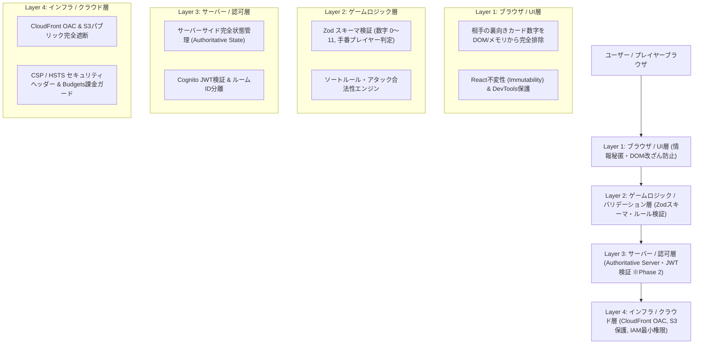

# セキュリティ 多層防御アーキテクチャ設計書 (Defense-in-Depth Spec)

本設計書は、「アルゴ（algo）Web対戦システム」における多層防御（Defense in Depth）アーキテクチャを定義します。
ボードゲームという公平性が最重要視されるアプリケーションにおいて、**「裏向きカードの覗き見チート防止（Information Hiding）」「ブラウザ側状態改ざん防止」「厳格なルールバリデーション」「ゼロトラスト・クラウドインフラ」** を4つの防護レイヤーで機械的に強制します。

---

## 1. 4層防護アーキテクチャ (4 Defense Layers for Algo)



---

## 2. レイヤー別防護詳細マトリクス

| 防護レイヤー | 適用コンポーネント | 防護メカニズム | 阻止する脅威・チートシナリオ |
| :--- | :--- | :--- | :--- |
| **Layer 1: ブラウザ / UI層** | React Components / State | ・**情報秘匿設計 (Information Hiding)**: 相手の伏せカード情報は `{ color: 'black', isOpen: false, number: null }` として描画。DOMやReactコンポーネントStateに相手のカード数字を決して渡さない。<br>・入力UI制約（0〜11ボタン、相手の伏せカードのみクリック可）。 | ・ブラウザの開発者ツール（DevTools）でDOMやNetworkタブを覗き見して相手の数字をカンニングするチートの完全抑止。 |
| **Layer 2: ゲームロジック層** | TypeScript Rule Engine / Zod | ・**厳格なスキーマ検証**: 宣言される数字が `0 <= n <= 11` かつ整数であることをZodで強制。<br>・**状態遷移バリデーション**: 手番プレイヤー以外の操作拒否、引いたカードのルール順（黒 < 白）ソート位置検証、脱落プレイヤーの操作拒否。 | ・パラメータ改ざん、範囲外数値入力、不正な順番でのアタック、手番横取りの防止。 |
| **Layer 3: サーバー / 認可層**<br>(Phase 2 拡張時) | AWS Lambda / WebSocket | ・**Authoritative Game Server**: カードシャッフル・山札・各プレイヤーの全手札の真の数字はLambdaサーバー側でのみ保持。<br>・クライアントへ送信するメッセージには各プレイヤーに見せて良い情報のみをマスキング（サニタイズ）して配信。<br>・Cognito JWTによるルーム所有権・参加者認可。 | ・クライアントスクリプト改変による強制勝利、不正スコア送信、他人のルームの傍受・妨害。 |
| **Layer 4: インフラ / クラウド層** | CloudFront / S3 / IAM / WAF | ・CloudFront OACによるS3バケットへの直アクセス禁止。<br>・厳格なContent-Security-Policy (CSP) による外部不正スクリプトの実行抑止。<br>・AWS Budgets $0.01アラートによる課金暴走防止。 | ・S3内ファイルの漏洩・不正アップロード、XSS攻撃、DDoS攻撃による高額請求。 |

---

## 3. カード情報秘匿設計（最重要セキュリティ規約）

アルゴにおいて最大の脅威は「相手の伏せカードの数字がブラウザ上で覗き見されること」です。本システムでは以下の原則を徹底します：

### 3.1 クライアントStateへのデータ露出一掃（Phase 1: CPU対戦モード）
CPU対戦モード（フロントエンド単体実行）であっても、グローバル変数や公開DOM属性（`data-card-number="7"` 等）に相手の数字を絶対に埋め込みません。
- **カード公開モデルの分離**:
  ```typescript
  // 公開用カード型（相手に見せる情報）
  export type PublicCard = {
    id: string;
    color: 'black' | 'white';
    isOpen: boolean;
    number: number | null; // isOpen === false の場合は必ず null !
  };

  // 内部保持用カード型（所有者またはゲームマスターのみが保持）
  export type SecretCard = {
    id: string;
    color: 'black' | 'white';
    isOpen: boolean;
    number: number; // 0〜11
  };

  // 互換性維持のための Card 型エイリアス（実体は SecretCard）
  export type Card = SecretCard;
  ```
- **マスキング関数 (`maskCardForPlayer`)**:
  - `maskCardForPlayer(card: Card, isOwner: boolean): PublicCard` を通し、相手の裏向きカード（`!card.isOpen && !isOwner`）は `number: null` に置換。
- 相手手札コンポーネントをレンダーする際、`number` プロパティは事前に `null` にマスクされた `PublicCard` 配列のみを渡します。これにより、React Developer Tools や DOM インスペクタを開いても相手の数字は一切確認できません。

### 3.2 サーバー権威型モデル（Phase 2: オンライン対戦モード）
オンライン対戦時、真の `SecretCard` 配列は DynamoDB / Lambda のメモリ上にのみ保持され、WebSocket通信時には各受信者のプレイヤーIDに応じて動的にマスキングフィルターを通します：
```typescript
// Lambdaからクライアントへブロードキャストする前のマスキング
export function sanitizeGameStateForPlayer(state: FullGameState, targetPlayerId: string): SanitizedGameState {
  return {
    ...state,
    players: state.players.map(player => ({
      ...player,
      hand: player.hand.map(card => {
        // 自分のカード、または既にOpenになっているカードのみ数字を開示
        if (player.id === targetPlayerId || card.isOpen) {
          return card;
        }
        // 相手の伏せカードは数字をnullにして抹消
        return { id: card.id, color: card.color, isOpen: false, number: null };
      })
    }))
  };
}
```

---

## 4. ブラウザ環境改ざん防止 ＆ 入力サニタイズ

1. **CSP (Content-Security-Policy) によるスクリプト隔離**:
   - 信頼された同一オリジン（`'self'`）以外の外部ドメインからのスクリプト読み込みをブラウザ側で完全遮断。
   - 不正なブラウザ拡張機能や悪意ある広告スクリプトによるゲームDOMのインジェクションを阻止。
2. **React XSS自動エスケープ ＆ サニタイズ**:
   - プレイヤー名、チャットメッセージ、ルームID等のユーザー入力値はすべてReactのJSXにより自動HTMLエスケープ処理を実施。
   - `dangerouslySetInnerHTML` の利用はプロジェクト全体で完全禁止。
