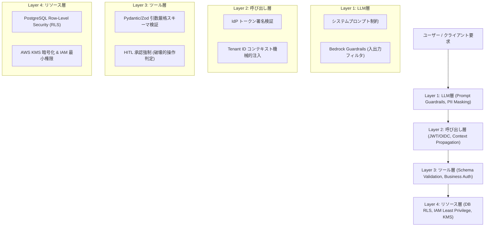

# セキュリティ 多層防御アーキテクチャ設計書

参照基準: [AWS Summit Japan 2026から見る、AIエージェントのセキュリティ・ガバナンス](https://zenn.dev/nttdata_tech/articles/4bc069bcb74185)

## 1. 4層防護アーキテクチャ (4 Defense Layers)
AIエージェントシステムの安全性は、LLMのプロンプトだけに依存してはなりません。本システムでは以下の4つの防護レイヤーを独立して配備し、単一レイヤーが突破された場合でも破局的影響を防ぎます。

---

## 2. レイヤー別防護詳細マトリクス

| 防護レイヤー | 適用コンポーネント | 防護メカニズム | 阻止する脅威・攻撃シナリオ |
| :--- | :--- | :--- | :--- |
| **Layer 1: LLM層** | プロンプト / LLM Gateway | 入出力コンテンツフィルタ、Amazon Bedrock Guardrails、PII自動マスキング | プロンプトインジェクション、不適切表現、機密情報の漏洩 |
| **Layer 2: 呼び出し層**| API Gateway / Middleware | JWT/OIDC署名検証、コンテキスト生成、`X-Tenant-ID` 自動付与 | 認証バイパス、セッションハイジャック、不正な呼び出し元 |
| **Layer 3: ツール層** | Backend Tool Handlers | Zod/Pydanticによる厳格な引数検証、権限スコープチェック、HITL承認確認 | パラメータ改ざん、SQLi/OSコマンド注入、権限のないツール悪用 |
| **Layer 4: リソース層**| Database / Cloud Storage | PostgreSQL RLS、AWS IAMポリシー、KMS暗号化（休止時・転送時） | 他テナントデータ越境閲覧、ストレージ不正アクセス、情報漏洩 |

---

## 3. テナント・ユーザー境界の機械的強制ルール
1. **プロンプト非依存**:
   - LLMに対して「テナントAのデータだけを検索してください」とプロンプトで指示するのみの設計を禁止する。
2. **実行コンテキストからの自動伝搬**:
   - バックエンドが認証トークンから `tenantId` を抽出し、ツール実行関数の第1引数、またはDBセッション変数へ機械的にセットする。
3. **リソース層での完全遮断**:
   - 仮にLLMやツール引数に他テナントのIDが混入した場合でも、DBのRLSによって物理的に「レコードが存在しない（404）」または「拒絶（403）」となる構成を必須とする。
