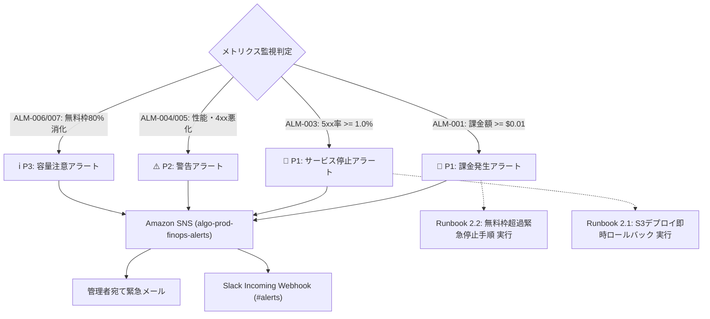

# SRE 監視アラートマトリクス (Alert Matrix)

本設計書は、「アルゴ（algo）Web対戦システム」における監視アラートの重大度定義、発報基準、通知チャネル、および初動対応を定義します。
特に**「予期せぬ課金発生（AWS Budgets $0.01突破）」**および**「CloudFront 5xxエラー急増によるサービス停止」**を最高重大度（P1）として迅速に検知・対処します。

---

## 1. アラート重要度レベル定義 (Severity Levels)

| 重要度 | レベル名 | 定義・影響度 | 初動対応目標 (MTTA) | 通知先 / 通知手段 |
| :---: | :--- | :--- | :---: | :--- |
| **P1** | **Critical** | システム全面停止（5xx多発）、または **AWS課金発生（$0.01超過）**。即座の介入が必要。 | 即時 (10分以内) | 運用管理者携帯メール ＋ Slack #alerts-critical（緊急メンション） |
| **P2** | **Major** | キャッシュヒット率急低下、高負荷によるSLO侵害予兆、特定パスの404多発。 | 30分以内 | Slack #alerts-warning |
| **P3** | **Warning** | 無料枠消化率80%到達、軽微なレイテンシ増加、非定常なアクセス傾向。 | 2時間以内 | Slack #alerts-info |
| **P4** | **Info** | CI/CDデプロイ成功通知、週次コストレポート（$0.00維持確認）。 | 翌営業日 | Slack #cicd-deployments |

---

## 2. 監視アラート定義一覧 (Alert Rules)

| アラートID | 監視対象メトリクス | 検知条件・しきい値 | 判定期間 | 重要度 | 自動アクション / 初動対応 |
| :--- | :--- | :--- | :---: | :---: | :--- |
| **ALM-001** | **AWS Budgets 実績課金額** | **ActualSpend >= $0.01** | 即時検知 | **P1** | 管理者へ即時緊急通報。AWS Cost Explorerで課金元リソース特定、必要に応じ緊急停止。 |
| **ALM-002** | **AWS Budgets 予想課金額** | **ForecastedSpend >= $0.01** | 1日1回判定 | **P2** | 月末無料枠超過予測の通知。アクセス増加要因または設定不備の調査。 |
| **ALM-003** | **CloudFront 5xx エラーレート** | **5xxErrorRate >= 1.0%** | 5分間継続 | **P1** | 直近デプロイの自動/手動ロールバック、S3オリジン権限・OAC疎通点検。 |
| **ALM-004** | **CloudFront キャッシュヒット率** | **CacheHitRate < 90.0%** | 15分間継続 | **P2** | キャッシュ無効化設定、Cache-Controlヘッダー設定の漏れ点検。 |
| **ALM-005** | **CloudFront 4xx エラーレート** | **4xxErrorRate >= 5.0%** | 10分間継続 | **P2** | 静的エクスポートパスの不整合、デッドリンク、不正な大量リクエスト（攻撃）の調査。 |
| **ALM-006** | **CloudFront 月間転送量警戒** | **BytesDownloaded >= 800 GB** (80%) | 月間累計 | **P3** | 1TB無料枠上限到達前のトラフィック分析、レート制限の引き締め検討。 |
| **ALM-007** | **CloudFront 月間リクエスト数警戒** | **Requests >= 8,000,000回** (80%) | 月間累計 | **P3** | 1,000万回無料枠上限到達前のボットアクセス点検。 |

---

## 3. アラート発報 ＆ エスカレーションフロー

