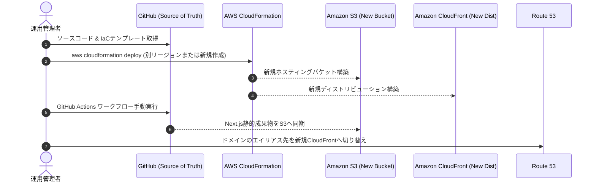

# SRE バックアップ・DR ＆ 定常運用設計書 (Backup & DR Spec)

本設計書は、「アルゴ（algo）Web対戦システム」におけるデータ保護、ディザスタリカバリ（DR: Disaster Recovery）、および定常保守運用を定義します。
静的Webホスティングおよびサーバーレス構成の特性を活かし、**「S3バージョニングによる誤削除保護」「Git＋IaCによるワンコマンド即時インフラ再構築」** を実現します。

---

## 1. 災害復旧 (DR) 目標値 ＆ 設計方針

| 項目 | 目標値 | 達成手段 |
| :--- | :---: | :--- |
| **目標復旧時点 (RPO)** | **0分** | Gitリポジトリに全ソースコード・設定が完全同期。S3バケットバージョニングにより直前アセットを完全保持。 |
| **目標復旧時間 (RTO)** | **15分以内** | CloudFormation / Terraform による全スタックのワンコマンド再構築。GitHub Actions による即時ビルド・同期。 |

---

## 2. データ保護 ＆ バックアップ方式

### 2.1 S3静的ホスティングバケットの保護
1. **オブジェクトバージョニング (Versioning)**:
   - S3バケットでバージョニングを有効化。誤ってオブジェクトを上書き・削除（Delete Marker）した場合でも、過去の正常なバージョンから即時復元可能。
2. **ライフサイクルルールによる容量制御**:
   - 無料枠（5GB）を圧迫しないよう、非現行世代（Noncurrent Versions）は **30日経過後** に自動消滅させる。
3. **MFA Delete（本番環境推奨）**:
   - バケット自体の削除や特定バージョンの完全削除にはMFA（多要素認証）を要求し、人的ミスやクレデンシャル漏洩時の全損を物理的に防ぐ。

### 2.2 将来拡張時（Phase 2: DynamoDB データ保護）
- **Point-in-Time Recovery (PITR)**:
  - 対戦履歴・ユーザープロファイルテーブルでPITRを有効化（秒単位で過去35日間の任意時点へ復元可能）。
- **TTLによる自動パージ**:
  - オンライン対戦ルーム（一時的セッションデータ）にはTTL属性を設定し、24時間後に無料枠消費なく自動クリーンアップ。

---

## 3. インフラ完全再構築手順（DR Runbook）

万一リージョン障害やAWSアカウント内リソースの全損事故が発生した場合の完全再構築手順です：



### 再構築コマンド例
```bash
# 1. CloudFormationでインフラ基盤を新規プロビジョニング
aws cloudformation deploy \
  --template-file infrastructure/cloudformation/root.yaml \
  --stack-name algo-prod-stack \
  --parameter-overrides Environment=prod \
  --capabilities CAPABILITY_IAM

# 2. 静的エクスポート成果物を生成・S3へデプロイ
npm ci
npm run build
aws s3 sync out/ s3://algo-prod-apne1-static-hosting-<new-account-id> --delete

# 3. 疎通確認
curl -I https://<new-distribution-domain>.cloudfront.net
```

---

## 4. 定常セキュリティ運用（脆弱性・依存関係管理）

1. **GitHub Dependabot**:
   - 毎週月曜日にNext.js, React, Tailwind CSS, Vitest等の依存ライブラリのセキュリティパッチを自動検知し、PRを起票。
2. **秘密情報のコミット監視**:
   - GitHub Secret Scanning および pre-commit hook により、AWSキーや個人情報がコードベースに混入することを未然に阻止。
