# SRE CI/CD パイプライン設計書 (CI/CD Pipeline Spec)

本設計書は、「アルゴ（algo）Web対戦システム」における継続的インテグレーション（CI）および継続的デプロイ（CD）パイプラインの設計を定義します。
GitHub Actions と **AWS IAM OIDC（OpenID Connect）キーレス認証** を採用し、**「静的解析・型検査・Vitest単体テスト」「テスト改ざん・骨抜き防止自動監査（Test Integrity）」「Playwright E2E ＆ スナップショット自動投稿」「静的ビルド」「課金ガードテスト」「自動タグ・GitHub Release発行」「S3/CloudFront自動デプロイ」** を完全自動化します。

---

## 1. CI/CD 基本方針 ＆ ブランチ戦略

1. **GitHub Flow 準拠**:
   - `main` ブランチへの直接コミット・直接プッシュは厳禁。
   - 機能追加・修正はトピックブランチ（`feature/*`, `fix/*`, `docs/*`）からPull Requestを作成して実施。
2. **ゼロクレデンシャル（AWS OIDC）**:
   - 長期アクセスキー（AWS Access Key / Secret Key）をリポジトリSecretsに一切保存しない。
   - GitHub Actions実行時のみ、OIDCトークンによって最小権限IAMロールを引き受ける。
3. **テスト完全性・骨抜き防止の機械的強制 (Test Integrity)**:
   - コミット前およびCI実行時に `npm run test:integrity`（`scripts/verify-test-integrity.js`）を実行。
   - 既存テストの改ざん、ダミー検証（`expect(true).toBe(true)`）、無効化（`.skip`）を機械的に検知・ブロック。
4. **ドキュメント整合性・アトミック更新の機械的強制 (Doc Integrity)**:
   - コミット前およびCI実行時に `npm run test:doc-integrity`（`scripts/verify-doc-integrity.js`）を実行。
   - UIコンポーネント、コアモジュール、監査イベント、永続化キーの設計書追従漏れ（Documentation Drift）を機械的に検知・ブロック。
5. **実機E2E ＆ スナップショットギャラリー自動検証**:
   - Playwright による主要対戦シナリオ（セットアップ、ドロー、アタック、決着）の自動E2E検証。
   - 実行時の実機画面スナップショットをアーティファクト保存し、PRコメントへ画像付きエビデンスを自動投稿。
6. **課金ガードテスト（FinOps CI Check）**:
   - ビルド成果物の総容量チェック（50MB以下であることを検証しS3無料枠圧迫を防止）。
   - CloudFrontキャッシュ破棄パスの単一化チェック（月1,000パス無料枠の浪費防止）。
7. **自動バージョニング ＆ GitHub Release発行**:
   - `main` マージ時にコミットログからセマンティックバージョニングを行い、自動でGitタグ（`vX.Y.Z`）を付与してGitHub Releaseを発行。

---

## 2. パイプライン全体フロー

```mermaid
flowchart TD
    subgraph PullRequest["Pull Request イベント (CI: ci.yml)"]
        PR["PR作成 / 更新コミットPush"] --> Step1["1. Lint & Format<br>(ESLint / Prettier)"]
        Step1 --> Step2["2. TypeCheck<br>(tsc --noEmit)"]
        Step2 --> Step3["3. Test Integrity Verification<br>(npm run test:integrity)"]
        Step3 --> Step3b["3b. Doc Integrity Verification<br>(npm run test:doc-integrity)"]
        Step3b --> Step4["4. Vitest 単体テスト<br>(ルール検証, CPU推論ロジック)"]
        Step4 --> Step5["5. Static Export Build<br>(next build -> out/)"]
        Step5 --> Step6["6. FinOps Guard Check<br>(成果物サイズ 50MB以下検査)"]
        Step6 --> Step7["7. Playwright E2E & Snapshot<br>(主要シナリオ自動検証 & 画面記録)"]
        Step7 --> Step8["8. テスト結果サマリPR自動投稿<br>(構造化テーブル & スナップショットリンク)"]
    end

    subgraph MergeMain["main マージ後イベント (CD: deploy.yml)"]
        Merge["main へのマージ"] --> CD_Tag["1. Automated Versioning & Release<br>(自動セマンティックタグ付与 & Release発行)"]
        CD_Tag --> CD_Build["2. Next.js 静的エクスポートビルド<br>(バージョン情報注入)"]
        CD_Build --> CD_OIDC["3. AWS OIDC 認証<br>(aws-actions/configure-aws-credentials)"]
        CD_OIDC --> CD_S3Sync["4. Amazon S3 同期<br>(aws s3 sync out/ s3://... --delete)"]
        CD_S3Sync --> CD_CFInvalidate["5. CloudFront キャッシュ無効化<br>(aws cloudfront create-invalidation)"]
        CD_CFInvalidate --> CD_Notify["6. デプロイ完了検証・通知"]
    end

    Step8 -->|全PASS & レビュー承認| Merge
```



---

## 3. CI/CD ステージ定義マトリクス

| ステージ名 | トリガー | 主な実行内容 | 使用コマンド / アクション | 失敗時の挙動 |
| :--- | :--- | :--- | :--- | :--- |
| **Lint & Format** | PR / Push | ソースコード構文・フォーマット検証 | `npm run lint` | PRマージをブロック |
| **TypeCheck** | PR / Push | TypeScript型の厳格チェック | `npx tsc --noEmit` | PRマージをブロック |
| **Test Integrity** | PR / Push | テスト改ざん・骨抜き防止自動監査 | `npm run test:integrity` | PRマージをブロック |
| **Doc Integrity** | PR / Push | ドキュメント整合性・アトミック更新自動監査 | `npm run test:doc-integrity` | PRマージをブロック |
| **Unit & Logic Tests** | PR / Push | ゲームルール、カードソート、CPU推論のVitest単体テスト | `npm run test` | PRマージをブロック |
| **Static Export Build** | PR / Push | Next.js静的ビルド検証（`out/` 出力確認） | `npm run build` | PRマージをブロック |
| **FinOps Guard Check** | PR / Push | ビルド成果物サイズ検査（上限50MB）、不正ファイル混入検知 | 成果物容量計測スクリプト | PRマージをブロック |
| **Playwright E2E & Snapshot** | PR / Push | ヘッドレスブラウザによる主要フロー自動実行＆実機画面保存 | `npm run test:e2e` | PRマージをブロック |
| **Test Summary Reporter** | PR (常時実行) | テスト結果・カバレッジをPRコメントへMarkdown自動投稿 | `actions/github-script` | 警告表示（CIは継続） |
| **Automated Versioning** | `main` マージ | 自動Gitタグ付与およびGitHub Releaseの自動発行 | GitHub CLI / Release Action | デプロイ中断 |
| **AWS OIDC Auth** | `main` マージ | GitHub OIDCトークンによるAWS一時クレデンシャル取得 | `aws-actions/configure-aws-credentials@v4` | デプロイ中断 |
| **S3 Sync** | `main` マージ | `out/` ディレクトリをS3バケットへ完全同期 | `aws s3 sync out/ s3://$BUCKET --delete` | デプロイ中断 |
| **CloudFront Invalidation**| `main` マージ | エッジキャッシュの即時無効化 | `aws cloudfront create-invalidation --paths "/*"` | Slack警告発報 |

---

## 4. GitHub Actions ワークフロー定義

### 4.1 CI ワークフロー (`.github/workflows/ci.yml` 抜粋)
- **テスト完全性・ドキュメント整合性監査の組み込み**:
  ```yaml
  - name: Run Test Integrity Verification
    run: npm run test:integrity

  - name: Run Doc Integrity Verification
    run: npm run test:doc-integrity
  ```
- **Playwright E2E ＆ スナップショットギャラリー**:
  ```yaml
  - name: Install Playwright Browsers
    run: npx playwright install --with-deps chromium

  - name: Run Playwright E2E Tests
    run: npm run test:e2e

  - name: Upload Playwright Screenshots & Reports
    if: always()
    uses: actions/upload-artifact@v4
    with:
      name: playwright-evidence
      path: |
        e2e-evidence/
        playwright-report/
  ```

### 4.2 CD ワークフロー (`.github/workflows/deploy.yml` 抜粋)
- **自動バージョニング ＆ GitHub Release**:
  - `main` マージ時に最新タグを取得・インクリメントし、Gitタグの作成とGitHub Releaseを発行。
  - バージョン番号をビルド時環境変数 `NEXT_PUBLIC_APP_VERSION` に注入して静的ビルド。
- **ゼロコストS3/CloudFrontデプロイ**:
  - AWS OIDC連携によりキーレスでS3バケット同期（`aws s3 sync`）およびCloudFrontキャッシュパージ（`create-invalidation`）を実行。
