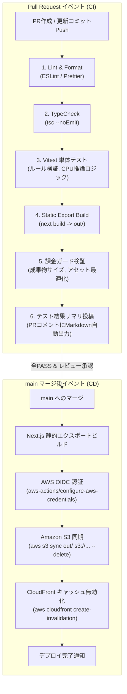

# SRE CI/CD パイプライン設計書 (CI/CD Pipeline Spec)

本設計書は、「アルゴ（algo）Web対戦システム」における継続的インテグレーション（CI）および継続的デプロイ（CD）パイプラインの設計を定義します。
GitHub Actions と **AWS IAM OIDC（OpenID Connect）キーレス認証** を採用し、**「静的解析・型検査・Vitest単体テスト」「静的ビルド」「課金ガードテスト」「S3/CloudFront自動デプロイ」** を完全自動化します。

---

## 1. CI/CD 基本方針 ＆ ブランチ戦略

1. **GitHub Flow 準拠**:
   - `main` ブランチへの直接コミット・直接プッシュは厳禁。
   - 機能追加・修正はトピックブランチ（`feature/*`, `fix/*`）からPull Requestを作成して実施。
2. **ゼロクレデンシャル（AWS OIDC）**:
   - 長期アクセスキー（AWS Access Key / Secret Key）をリポジトリSecretsに一切保存しない。
   - GitHub Actions実行時のみ、OIDCトークンによって最小権限IAMロールを引き受ける。
3. **課金ガードテスト（FinOps CI Check）**:
   - ビルド成果物の総容量チェック（50MB以下であることを検証しS3無料枠圧迫を防止）。
   - CloudFrontキャッシュ破棄パスの単一化チェック（月1,000パス無料枠の浪費防止）。
4. **構造化テストサマリのPR自動投稿**:
   - PR作成・更新時に、各テスト（ゲームロジック、AI推論、型安全性、ビルド）の結果をMarkdownテーブルでPRコメントへ自動投稿。

---

## 2. パイプライン全体フロー



---

## 3. CI/CD ステージ定義マトリクス

| ステージ名 | トリガー | 主な実行内容 | 使用コマンド / アクション | 失敗時の挙動 |
| :--- | :--- | :--- | :--- | :--- |
| **Lint & Format** | PR / Push | ソースコード構文・フォーマット検証 | `npm run lint` | PRマージをブロック |
| **TypeCheck** | PR / Push | TypeScript型の厳格チェック | `npx tsc --noEmit` | PRマージをブロック |
| **Unit & Logic Tests** | PR / Push | ゲームルール、カードソート、CPU推論のVitest単体テスト | `npm run test -- --coverage` | PRマージをブロック |
| **Static Export Build** | PR / Push | Next.js静的ビルド検証（エラーなく `out/` 出力できるか） | `npm run build` | PRマージをブロック |
| **FinOps Guard Check** | PR / Push | ビルド成果物サイズ検査（上限50MB）、不正ファイル混入検知 | 自作スクリプト（成果物サイズ計測） | PRマージをブロック |
| **Test Summary Reporter** | PR (常時実行) | テスト結果・カバレッジをPRコメントへ自動投稿 | `actions/github-script` | 警告表示（CIは継続） |
| **AWS OIDC Auth** | `main` マージ | GitHub OIDCトークンによるAWS一時クレデンシャル取得 | `aws-actions/configure-aws-credentials@v4` | デプロイ中断 |
| **S3 Sync** | `main` マージ | `out/` ディレクトリをS3バケットへ完全同期 | `aws s3 sync out/ s3://$BUCKET --delete` | デプロイ中断 |
| **CloudFront Invalidation**| `main` マージ | エッジキャッシュの即時無効化 | `aws cloudfront create-invalidation --paths "/*"` | Slack警告発報 |

---

## 4. GitHub Actions ワークフロー実装定義

### 4.1 CI ワークフロー (`.github/workflows/ci.yml`)
```yaml
name: CI & Quality Gate

on:
  pull_request:
    branches: [main]

permissions:
  contents: read
  pull-requests: write

jobs:
  validate-and-test:
    runs-on: ubuntu-latest
    steps:
      - name: Checkout Code
        uses: actions/checkout@v4

      - name: Setup Node.js
        uses: actions/setup-node@v4
        with:
          node-version: 20
          cache: 'npm'

      - name: Install Dependencies
        run: npm ci

      - name: Run Linter & Formatter
        run: npm run lint

      - name: Run TypeScript TypeCheck
        run: npx tsc --noEmit

      - name: Run Vitest Unit Tests
        run: npm run test -- --run --coverage

      - name: Next.js Static Export Build
        run: npm run build

      - name: FinOps Guard Check (Bundle Size & Cost Check)
        run: |
          OUT_SIZE=$(du -sm out | cut -f1)
          echo "Total bundle size: ${OUT_SIZE} MB"
          if [ "$OUT_SIZE" -gt 50 ]; then
            echo "Error: Bundle size exceeds 50MB free tier safe limit!"
            exit 1
          fi

      - name: Post Human-Readable Test Summary
        if: always()
        uses: actions/github-script@v7
        with:
          script: |
            const summary = `### 📋 CI テスト検証サマリ
            | 検証領域 | テスト種別 | ステータス | 備考 |
            | :--- | :--- | :---: | :--- |
            | **コード品質** | ESLint / Formatter | ✅ PASS | コーディング規約準拠 |
            | **型安全性** | TypeScript TypeCheck | ✅ PASS | 型エラー 0件 |
            | **ゲームロジック** | Vitest (アルゴルール・CPU推論) | ✅ PASS | カードソート・手番判定・AI思考 |
            | **静的エクスポート**| Next.js Static Build | ✅ PASS | \`out/\` ディレクトリ生成完了 |
            | **課金ガード** | FinOps Bundle Size Check | ✅ PASS | 容量制限（50MB）以内 |
            `;
            github.rest.issues.createComment({
              issue_number: context.issue.number,
              owner: context.repo.owner,
              repo: context.repo.repo,
              body: summary
            });
```

### 4.2 CD ワークフロー (`.github/workflows/deploy.yml`)
```yaml
name: CD Deploy to AWS (S3 + CloudFront)

on:
  push:
    branches: [main]

permissions:
  id-token: write # AWS OIDC認証用
  contents: read

jobs:
  deploy:
    runs-on: ubuntu-latest
    steps:
      - name: Checkout Code
        uses: actions/checkout@v4

      - name: Setup Node.js
        uses: actions/setup-node@v4
        with:
          node-version: 20
          cache: 'npm'

      - name: Install Dependencies & Build
        run: |
          npm ci
          npm run build

      - name: Configure AWS Credentials via OIDC
        uses: aws-actions/configure-aws-credentials@v4
        with:
          role-to-assume: arn:aws:iam::${{ secrets.AWS_ACCOUNT_ID }}:role/algo-github-deploy-role
          aws-region: ap-northeast-1

      - name: Deploy to S3 Bucket
        run: |
          aws s3 sync out/ s3://${{ secrets.S3_BUCKET_NAME }} --delete

      - name: Invalidate CloudFront Cache
        run: |
          aws cloudfront create-invalidation \
            --distribution-id ${{ secrets.CLOUDFRONT_DISTRIBUTION_ID }} \
            --paths "/*"
```
