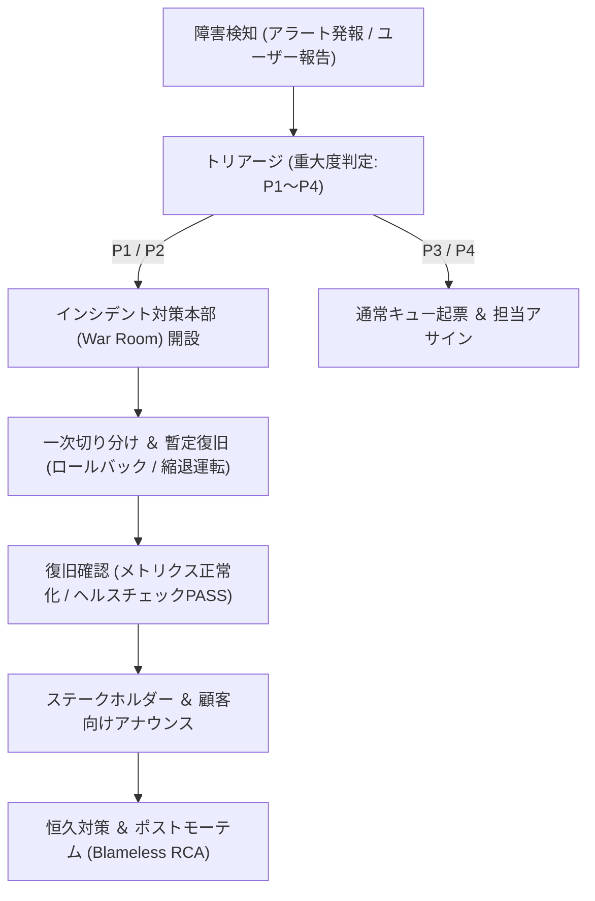

# SRE インシデント初動 ＆ Runbook基本設計書

## 1. インシデント初動対応フロー (Incident Response Flow)



---

## 2. 標準ロールバック手順 (Rollback Runbook)

### 2.1 コンテナ / アプリケーションのロールバック
直近のデプロイ後にP1/P2アラートが発生した場合の標準手順：
```bash
# 1. 現在のデプロイステータス確認
aws ecs describe-services --cluster <cluster-name> --services <service-name>

# 2. 直前の安定タスク定義リビジョンへロールバック
aws ecs update-service \
  --cluster <cluster-name> \
  --service <service-name> \
  --task-definition <task-def-family>:<previous-stable-revision>

# 3. デプロイ完了待機
aws ecs wait services-stable --cluster <cluster-name> --services <service-name>
```

### 2.2 データベースマイグレーションのロールバック
```bash
# 1. ロールバック用マイグレーションコマンド実行
npm run migrate:down # または alembic downgrade -1

# 2. RLSポリシーおよびテーブル構造の整合性検証
npm run test:db-verify
```

---

## 3. ポストモーテム（事後振り返り）テンプレート
障害解消後、24時間以内に以下の項目を整理したドキュメントを作成します：
1. **概要**: 発生事象、影響範囲（影響ユーザー数・時間）
2. **タイムライン**: 検知、初動、ロールバック、完全復旧の時系列
3. **根本原因（Root Cause / 5 Whys）**: 直接原因およびプロセス的要因
4. **良かった点・改善点**: 初動検知速度、手順書の充足状況
5. **恒久再発防止アクション**: レビュー観点の追加（`@refine-review-criteria` 実行）、自動テストの拡充
