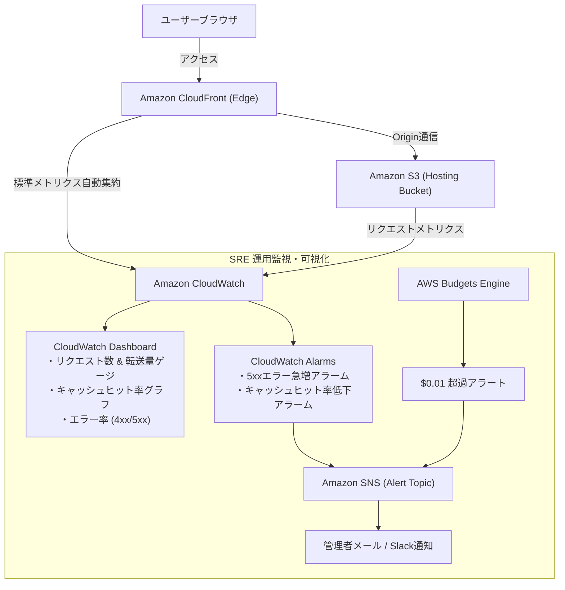

# SRE 可観測性 ＆ SLI/SLO 設計書 (Observability & SLO Spec)

本設計書は、「アルゴ（algo）Web対戦システム」におけるサービスレベル目標（SLO: Service Level Objectives）、サービスレベル指標（SLI: Service Level Indicators）、およびAWS CloudWatchを中心とする可観測性（Observability）アーキテクチャを定義します。
静的ホスティング＋CloudFrontエッジ配信を基軸とし、**「高可用性」「高キャッシュヒット率による無料枠維持」「極小エラー率」** を定量管理します。

---

## 1. サービスレベル目標 (SLI / SLO 定義マトリクス)

| サービス領域 | SLI (指標定義式) | SLO (目標値) | 測定ウィンドウ | エラーバジェット消費条件 ＆ アクション |
| :--- | :--- | :---: | :---: | :--- |
| **CloudFront 可用性** | `(1 - (5xxErrorRequests ÷ TotalRequests)) × 100` | **99.9% 以上** | 過去30日間ローリング | 5xxエラー率が0.1%を超過。即時デプロイロールバックを検討。 |
| **エッジキャッシュヒット率** | `(CacheHitRequests ÷ TotalRequests) × 100` | **95.0% 以上** | 過去30日間ローリング | ヒット率が95%未満に低下。S3オリジンへのリクエスト急増による無料枠超過リスクを検知・Cache-Control見直し。 |
| **全エラー率 (4xx + 5xx)**| `(TotalErrorRequests ÷ TotalRequests) × 100` | **0.1% 未満** | 過去30日間ローリング | パス解決不正（404急増）やOAC認証失敗（403）の検知。 |
| **オリジン応答時間** | S3 / Lambda オリジンレイテンシ (p95) | **< 150 ms** | 過去30日間ローリング | 静的アセット配信遅延の調査。 |
| **ゼロコスト維持率** | 月額利用料金 | **$0.00** | 毎月（1日〜末日） | 累計料金が $0.01（1セント）に到達した時点でアラート即時発報。 |

---

## 2. CloudWatch 主要メトリクス一覧

### 2.1 Amazon CloudFront メトリクス (`AWS/CloudFront` 名前空間)
- `Requests`: 総リクエスト数（無料枠 1,000万回/月 の消化ペースを監視）
- `BytesDownloaded`: ダウンロードバイト数（無料枠 1TB/月 の消化ペースを監視）
- `4xxErrorRate`: クライアントエラー率（不正URL、404アセット欠損の検知）
- `5xxErrorRate`: サーバーエラー率（S3・エッジ障害の検知）
- `TotalErrorRate`: 総エラー率（SLO違反判定用）
- `OriginLatency`: オリジンとの通信時間

### 2.2 AWS Budgets メトリクス (`AWS/Budgets`)
- `ActualSpend`: 当月実績利用額（閾値: $0.01）
- `ForecastedSpend`: 当月末予想利用額（閾値: $0.01）

---

## 3. 可観測性アーキテクチャ図

---

## 4. CloudWatch 監視ダッシュボード設計 (Single Pane of Glass)

運用者がひと目で無料枠の残量とシステムの健全性を把握できるよう、以下のウィジェットを配置したダッシュボード（`algo-prod-dashboard`）をIaCで構築します：

1. **FinOps & 無料枠ゲージ**:
   - 当月累計データ転送量 (GB / 1,000GB 上限)
   - 当月累計リクエスト数 (回 / 10,000,000回 上限)
   - AWS Budgets 現在利用額 ($0.00)
2. **SLO ヘルスウィジェット**:
   - CloudFront 可用性パーセンテージ (目標: >= 99.9%)
   - キャッシュヒット率パーセンテージ (目標: >= 95.0%)
3. **エラー & パフォーマンス折れ線グラフ**:
   - 4xx / 5xx エラーレート（過去24時間）
   - オリジンレイテンシ p50 / p95 / p99
